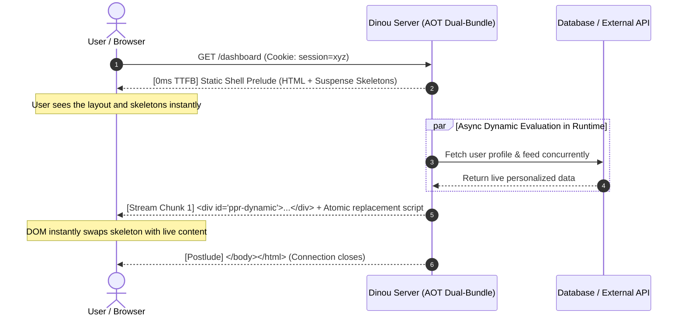

# Dinou v7: Master Architectural Context, Specification & Migration Guide

> **Comprehensive Architecture & System Context Document**  
> *Author:* Dinou Core Team & Antigravity  
> *Version:* Dinou v7 (PPR, Cache Slots, Layered Segmentation & Universal Multi-Runtime)  
> *Status:* Production Ready · 100% Verified across Node.js, Cloudflare Workers, Deno, Bun & Static SSG  

---

## Table of Contents

1. [Breaking Changes (Dinou v7 vs Dinou v6)](#1-breaking-changes-dinou-v7-vs-dinou-v6)
2. [The Core Breakthrough: "Deploy Everywhere"](#2-the-core-breakthrough-deploy-everywhere)
3. [The Architectural Leap: 0-Fork Dual-Bundle Pipeline](#3-the-architectural-leap-0-fork-dual-bundle-pipeline)
4. [Layered Segmentation Architecture](#4-layered-segmentation-architecture)
   - 4.1. [Horizontal Segmentation (Routes & Layouts)](#41-horizontal-segmentation-routes--layouts)
   - 4.2. [`layout_functions` for Decoupled Layout ISR](#42-layout_functions-for-decoupled-layout-isr)
   - 4.3. [Vertical Segmentation (`DinouCacheSlot`)](#43-vertical-segmentation-dinoucacheslot)
   - 4.4. [Partial Prerendering (PPR) Engine](#44-partial-prerendering-ppr-engine)
5. [Resilience, Isolation & Error Handling in React 19](#5-resilience-isolation--error-handling-in-react-19)
   - 5.1. [Elimination of HTML Double-Wrapping in Error SSR (`getErrorJSX`)](#51-elimination-of-html-double-wrapping-in-error-ssr-geterrorjsx)
   - 5.2. [Handling `SuspenseException` in React 19 with `use()`](#52-handling-suspenseexception-in-react-19-with-use)
   - 5.3. [Two-Level Error Boundaries with Clean Navigation Reset](#53-two-level-error-boundaries-with-clean-navigation-reset-sloterrorboundary--innererrorboundary)
6. [Developer Experience (DX) & Next-Gen Dev Engine](#6-developer-experience-dx--next-gen-dev-engine)
   - 6.1. [100% In-Memory Dev Server (0-Disk I/O)](#61-100-in-memory-dev-server-0-disk-io)
   - 6.2. [SWC Disk-Mirror Architecture for Massive Projects](#62-swc-disk-mirror-architecture-for-massive-projects)
   - 6.3. [Multi-Bundler Parity (Esbuild, Rollup, Webpack)](#63-multi-bundler-parity-esbuild-rollup-webpack)
   - 6.4. [Intelligent Port Selector](#64-intelligent-port-selector)
   - 6.5. [Configurable `React.StrictMode` & React Compiler Parity](#65-configurable-reactstrictmode--react-compiler-parity)
7. [Universal Deployment Targets & Practical Guide](#7-universal-deployment-targets--practical-guide)
8. [Configuration, Middleware & Public CLI](#8-configuration-middleware--public-cli)
9. [Architectural Comparison Matrix (v6 vs v7)](#9-architectural-comparison-matrix-v6-vs-v7)

---

## 1. Breaking Changes (Dinou v7 vs Dinou v6)

Upgrading from Dinou v6 to Dinou v7 introduces three foundational breaking changes designed to eliminate ambiguities, optimize memory and CPU usage, and establish a single source of truth for routing and data contracts.

### 1.1. `getProps` Contract: Direct Props Object Return

In Dinou v6, `getProps` in `page_functions.ts` required returning an object nested under the `page` key:
```typescript
// ❌ Dinou v6 (Deprecated)
export async function getProps({ params }) {
  const user = await fetchUser(params.id);
  return {
    page: {
      user,
      title: `Profile of ${user.name}`,
    },
  };
}
```

In **Dinou v7**, `getProps` directly returns the component props object. The wrapping `{ page: ... }` is completely removed:
```typescript
// ✅ Dinou v7 (Current)
export async function getProps({ params }) {
  const user = await fetchUser(params.id);
  return {
    user,
    title: `Profile of ${user.name}`,
  };
}
```
* **Page component consumption**: The component receives `user` and `title` directly as top-level props:
  ```tsx
  export default function ProfilePage({ user, title }: { user: User; title: string }) {
    return <h1>{title}</h1>;
  }
  ```

---

### 1.2. `revalidate` Time Unit: Strictly Seconds (`s`), Not Milliseconds (`ms`)

In Dinou v6, `revalidate` was expressed in milliseconds (`ms`). This conflicted with the HTTP standard RFC 7234 (`Cache-Control: max-age=N`, `s-maxage=N`), modern CDNs (Cloudflare, Fastly), and component-level caching.

In **Dinou v7**, `revalidate` is **strictly defined in seconds (`s`)**:
```typescript
// ❌ Dinou v6: 60000 (60,000 milliseconds)
export const revalidate = 60000;

// ✅ Dinou v7: 60 (60 seconds)
export const revalidate = 60;
```
* **Unified Alignment**: This 1-second scale applies uniformly across `page_functions`, `layout_functions`, and `<DinouCacheSlot revalidate={60} />`.

---

### 1.3. Elimination of `dynamic`: Single Source of Truth via `revalidate`

In Dinou v6, routes could declare both `dynamic = true / false` and `revalidate = N`, creating conflicting states (e.g. `dynamic = true` with `revalidate = 60`).

In **Dinou v7**, the `dynamic` keyword is **completely removed from the framework**. `revalidate` is the **single source of truth** for route caching and rendering behavior:

| Value of `revalidate` | Route Rendering Mode | Behavior |
| :--- | :--- | :--- |
| **`0`** (or any number **`< 1`**) | **Dynamic (SSR)** | Rendered dynamically on every incoming request. Bypasses static and ISR cache. |
| **`>= 1`** (e.g., `60`, `3600`) | **Incremental Static Regeneration (ISR)** | Pre-rendered or cached with background stale-while-revalidate expiring after $N$ seconds. |
| **`false`** (or omitted / `undefined`) | **Static Forever (SSG)** | Pre-rendered at build time and cached indefinitely until manual on-demand revalidation (`revalidatePath` / `revalidateTag`). |

```typescript
// Dynamic route (Live SSR on every request)
export const revalidate = 0; // or: export function revalidate() { return 0; }

// ISR route (Refreshes every 5 minutes in background)
export const revalidate = 300;

// Static route (Cached permanently)
export const revalidate = false; // or omit the export
```

---

## 2. The Core Breakthrough: "Deploy Everywhere"

For years, React Server Components (RSC) and React 19 frameworks suffered from platform lock-in. Many features (Server Actions, Suspense streaming, ISR) were engineered to run exclusively on proprietary serverless cloud platforms or via heavy, monolithic Node servers.

**Dinou v7 eliminates platform lock-in entirely:**
> **Any Dinou application built with React 19 and Server Components can be compiled and deployed to virtually any hosting infrastructure:** from a zero-cold-start Cloudflare Worker at the edge, to Deno Deploy, bare-metal Bun, containerized Node.js in Docker/Kubernetes, self-contained single-binary executables (`bun build --compile` / `deno compile`), all the way to 100% free static hosting (GitHub Pages, Surge, AWS S3).

---

## 3. The Architectural Leap: 0-Fork Dual-Bundle Pipeline

### 3.1. The React 19 Dual Condition Conflict
React 19 imposes a strict module-resolution constraint:
* **RSC Engine**: Requires modules to be imported under the `"react-server"` export condition (disabling browser APIs like `useState`, `useEffect`, `react-dom/server`).
* **SSR Engine**: Requires modules to be imported under client conditions (`"browser"` / `react-dom/server.edge` / `react-dom/server.node`).
* Importing both engines within the same unisolated module scope throws:
  ```text
  ReactServer has been imported outside of react-server condition.
  ```

### 3.2. Why the Legacy `child_process.fork()` was Eliminated
Earlier meta-frameworks circumvented this in Node.js by spawning an external child process via `child_process.fork()`:
* **IPC Serialization Latency**: Every incoming request incurred serialization/deserialization across OS process boundaries.
* **Double Memory Footprint**: Two full Node runtimes running concurrently per server instance.
* **Incompatible with Edge & Serverless**: Cloudflare Workers, Deno Deploy, and AWS Lambda **do not support `child_process.fork()`**.
* **Incompatible with Single-Binary Compilation**: Standalone binary packagers cannot bundle external process-spawning logic.

### 3.3. The 3-Pass Ahead-of-Time (AOT) Dual-Bundle Architecture
Dinou v7 standardizes a unified in-memory 3-pass compilation pipeline across **ALL runtimes (Node, Deno, Bun, Cloudflare)**:

```
                            [ Incoming Request (HTTP / Fetch) ]
                                              │
                                              ▼
                   ┌────────────────────────────────────────────────────────┐
                   │                 Target Orchestrator                    │
                   │   Node (server.mjs) / Deno (main.js) / Bun / Worker    │
                   └───────────────────────────┬────────────────────────────┘
                                               │
               ┌───────────────────────────────┴───────────────────────────────┐
               ▼                                                               ▼
     Static Asset / SSG Cache?                                       Dynamic Route / RSC / SF?
               │                                                               │
               ▼                                                               ▼
  ┌─────────────────────────┐                                    ┌───────────────────────────┐
  │   Instant Delivery      │                                    │   Worker Orchestrator     │
  │ (Disk / KV / CDN Assets)│                                    │   (Pass C)                │
  └─────────────────────────┘                                    └─────────────┬─────────────┘
                                              ┌────────────────────────────────┴────────────────────────────────┐
                                              ▼                                                                 ▼
                                 ┌──────────────────────────────┐                                  ┌──────────────────────────────┐
                                 │     Pass A: RSC Engine       │                                  │     Pass B: SSR Engine       │
                                 │ (conditions: [react-server]) │                                  │  (conditions: [browser])     │
                                 │                              │                                  │                              │
                                 │ - React 19 Server Components │        RSC Payload Stream        │ - react-dom/server.edge      │
                                 │ - Server Functions RPC       │ ───────────────────────────────> │ - SSR Client Manifest        │
                                 │ - Client Component Proxies   │      (ReadableStream)            │ - Native Streaming HTML      │
                                 └──────────────────────────────┘                                  └──────────────┬───────────────┘
                                                                                                                   │
                                                                                                                   ▼
                                                                                                    [ Streaming HTML Response ]
```

1. **Pass A — RSC Engine**:
   - Bundled with `["react-server"]` export conditions.
   - Client Components (`"use client"`) are converted into lightweight client reference descriptors (`createClientModuleProxy`) via the `clientReferencesPlugin`.
   - Registers and binds Server Functions (`"use server"`).
2. **Pass B — SSR Engine**:
   - Bundled with `["browser"]` / client export conditions.
   - Packages `react-dom/server.edge` (`renderToReadableStream`) and the auto-generated `ssr-client-manifest.js` with physical client implementations for hydration.
3. **Pass C — Orchestrator (Runtime Adapter)**:
   - In-memory interconnection connecting Pass A and Pass B via standard W3C Web Streams (`ReadableStream`).
   - Dispatches static assets with optimal caching headers and coordinates the `StorageAdapter` (ISR).

---

## 4. Layered Segmentation Architecture

Dinou v7 introduces a two-dimensional segmentation model: **Horizontal** (decoupling layouts from pages) and **Vertical** (decoupling static from dynamic content inside the same screen via PPR and `DinouCacheSlot`).

```
┌────────────────────────────────────────────────────────┐
│  Layout (Horizontal Segmentation - Cached Shell)       │
│  ┌──────────────────────────────────────────────────┐  │
│  │  Page: Static Shell (PPR) / Dynamic Content      │  │
│  │  ┌────────────────────┐  ┌────────────────────┐  │  │
│  │  │ DinouCacheSlot     │  │ DinouCacheSlot     │  │  │
│  │  │ (Micro-ISR / SWR)  │  │ (Live Refreshable) │  │  │
│  │  │ revalidate: 60s    │  │ tag: metrics-tag   │  │  │
│  │  └────────────────────┘  └────────────────────┘  │  │
│  └──────────────────────────────────────────────────┘  │
└────────────────────────────────────────────────────────┘
```

### 4.1. Horizontal Segmentation (Routes & Layouts)

#### A. Decoupled Endpoints
- **Layout Plane (`____rsc_layout____`)**: Renders exclusively the layout shell and parallel slots, embedding a dynamic marker (`<DinouPageSlot />`) where child content will reside.
- **Page Plane (`____rsc_page____`)**: Renders exclusively the leaf page component (`<Page />`).

#### B. `DinouPageSlot` & `DinouPageContext`
```jsx
<DinouPageContext.Provider value={slotContextValue}>
  {layoutPromise ? use(layoutPromise) : use(pagePromise)}
</DinouPageContext.Provider>
```
* **Total State Preservation**: When navigating between sibling routes (e.g. `/dashboard/analytics` to `/dashboard/settings`), the layout **never unmounts or re-executes**. Video/audio players keep playing, open dropdowns stay open, and sidebar search input values persist intact.
* **Query-String Aware (`searchPart`)**: Layout caches index `${layoutKey}${searchPart}`, propagating search parameter modifications (e.g., `?tab=billing`) in real time to layout slots.

---

### 4.2. `layout_functions` for Decoupled Layout ISR

Layouts can declare independent cache lifetimes, tags, and parameter validations via `layout.functions.ts` or named exports in `layout.tsx`:

```typescript
// src/dashboard/layout_functions.ts
export const revalidate = 3600; // Cache the layout shell for 1 hour
export const tags = ["dashboard-shell", "nav-links"];
export const allowISG = true;

export async function validateParams(params) {
  return true;
}
```
* **Independent Invalidation**: Calling `revalidateTag("dashboard-shell")` purges the layout without forcing the re-rendering of all 50 underlying child pages.

---

### 4.3. Vertical Segmentation (`DinouCacheSlot`)

`DinouCacheSlot` provides micro-caching at the component level within a page:

#### Level 1: Micro-ISR of Server Components & SWR
* Server Components wrapped in `<DinouCacheSlot id="metrics" tag="metrics-tag" revalidate={60}>` are serialized as JSX trees.
* **Stale-While-Revalidate (SWR)**: Expired slots serve stale content immediately while a background task (`waitUntil`) updates the slot cache in the active `StorageAdapter`.
* **Granular Tag Purging**: Calling `revalidateTag("metrics-tag")` invalidates only that component without re-rendering sibling components or the parent page.

#### Level 2: In-Place Live Refresh from Client (Zero Page Reload)
* Slots are automatically wrapped in a `DinouCacheSlotBoundary`.
* Triggered programmatically from Client Components without reloading the page or touching sibling states:
  ```tsx
  "use client";
  import { refreshSlot, useRouter } from "dinou";

  export default function RefreshButton() {
    const router = useRouter();
    return (
      <button onClick={() => refreshSlot("metrics")}>
        Refresh Metrics Only
      </button>
    );
  }
  ```
* Requests `/____rsc_slot____/:id` directly and reconciles the DOM in place.

---

### 4.4. Partial Prerendering (PPR) Engine

Partial Prerendering unifies static performance (0ms TTFB) with dynamic personalization in a single route:



#### Declaring PPR in `page_functions.ts` or `layout_functions.ts`
PPR is declared exclusively in functions files (constants or sync/async functions):

```typescript
// src/dashboard/page_functions.ts
export const ppr = true;

// Or as an async function:
export async function ppr() {
  return true;
}
```

* **Cascading Layout Inheritance**: Declaring `export const ppr = true;` in `src/dashboard/layout_functions.ts` automatically enables PPR for all nested pages and child layouts under `/dashboard/*`.
* **Granular Opt-Out**: Child routes can opt out explicitly:
  ```typescript
  // src/dashboard/admin/page_functions.ts
  export const ppr = false;
  ```

#### Component Implementation with `<Suspense>`
```tsx
// src/dashboard/page.tsx
import React, { Suspense } from "react";
import { getContext } from "dinou";

async function UserFeed() {
  const ctx = getContext();
  const user = ctx?.req?.cookies?.user || "Guest";
  const data = await fetchFeedForUser(user);
  return <FeedList items={data} />;
}

export default function Dashboard() {
  return (
    <div>
      {/* 🚀 Static Shell: Sent at 0ms TTFB */}
      <header><h1>Dashboard</h1></header>

      {/* ⚡ Dynamic Hole: Streamed and replaced on the fly */}
      <Suspense fallback={<div className="skeleton">Loading feed...</div>}>
        <UserFeed />
      </Suspense>
    </div>
  );
}
```

---

## 5. Resilience, Isolation & Error Handling in React 19

During development and multi-browser E2E testing on Windows, Linux, and Edge runtimes, three critical resilience and React 19 streaming challenges were identified and engineered directly into Dinou's core:

### 5.1. Elimination of HTML Double-Wrapping in Error SSR (`getErrorJSX`)

#### The Problem & Diagnostic
When an unhandled exception or render error occurred during Server-Side Rendering (SSR), Dinou invoked `getErrorJSX` to generate an error response. Previously, the logic checked whether the root JSX element was literally of type `"html"`:
* When a route crashed outside of any layout (e.g. an isolated 404 or unhandled server crash), the server needed to supply a complete HTML document: `<html><head>...</head><body><Error /></body></html>`.
* However, when the crashed page was nested inside an application layout (`layout.tsx`), the root component was the layout function itself (`<RootLayout>`), which was not equal to `"html"`.
* As a consequence, the server blindly wrapped the entire layout inside another emergency `<html><head><body>...</body></html>` shell.
* **The Failure**: This produced invalid HTML (a nested `<html>` document inside another `<body>`), causing catastrophic hydration mismatch crashes in React 19 on the client:
  ```html
  <!-- ❌ Broken SSR Output (Hydration mismatch in React 19) -->
  <html>
    <body>
      <div id="root">
        <html>  <!-- Nested root layout HTML tag! -->
          <body>
            <header>Navbar</header>
            <main>Error occurred</main>
          </body>
        </html>
      </div>
    </body>
  </html>
  ```

#### The Implementation & Solution
In [`dinou/core/get-error-jsx.js`](file:///c:/Users/roggc/dev/my-dinou-apps/dinou-e2e/dinou/core/get-error-jsx.js#L347-L364), Dinou tracks `layoutApplied`:
```javascript
const hasHtml = jsx?.type === "html" || (Array.isArray(jsx) && jsx.some((c) => c?.type === "html"));

if (!layoutApplied && !hasHtml) {
  // Only inject <html>/<body> if NO application layout was applied AND no <html> exists
  jsx = React.createElement(
    "html",
    { lang: "en" },
    React.createElement("head", null, ...),
    React.createElement("body", null, jsx)
  );
}
```
* **Result**: When an application layout is present (`layoutApplied === true`), the error JSX is injected directly into the layout's active slot (`{children}` or `<DinouPageSlot />`). The root layout shell remains structurally valid, avoiding hydration errors while preserving interactive sidebars, headers, and navigation menus.

---

### 5.2. Handling `SuspenseException` in React 19 with `use()`

#### The Problem & Diagnostic
During soft client navigation (SPA), when a route's payload rejected with an error, Dinou needed to dynamically resolve and mount the route's custom `error.tsx` component. In React 19, reading pending asynchronous promises inside component bodies is performed with the `use(promise)` hook.

However:
* When a promise passed to `use()` is still pending (e.g., fetching the error component chunk over the network), React 19 **intentionally throws an internal suspension exception (`SuspenseException`)**.
* This exception is not an error; it is React's internal signaling mechanism to pause rendering at that component and hand control up to the nearest `<Suspense>` boundary until the promise resolves.
* **The Failure**: If `use(errorPromise)` was executed inside an eager JavaScript `try / catch` block, the `catch (e)` intercepted React's internal `SuspenseException`, mistaking it for a fatal runtime crash. It aborted the suspension flow and immediately fell back to the emergency dev error screen (`DefaultDevError`), preventing the user's custom `error.tsx` from ever displaying.

#### The Implementation & Solution
In [`dinou/core/slot.js`](file:///c:/Users/roggc/dev/my-dinou-apps/dinou-e2e/dinou/core/slot.js#L206-L211), `SlotErrorRenderer` was decoupled from eager `try / catch` statements and isolated inside a native React `<Suspense>` boundary:
```jsx
// dinou/core/slot.js (SlotErrorBoundary render)
if (this.state.hasError) {
  const reset = () => this.setState({ hasError: false, error: null });
  return createElement(
    InnerErrorBoundary,
    null,
    createElement(
      Suspense,
      { fallback: null },
      createElement(SlotErrorRenderer, { error: this.state.error, reset })
    )
  );
}
```
* **Result**: When `use(errorPromise)` suspends while loading the error chunk, React 19 handles the suspension natively via `<Suspense fallback={null}>`. Once the promise settles, React seamlessly mounts the custom `error.tsx` component with its `error` and `reset` props, without flickering or jumping to fallback screens.

---

### 5.3. Two-Level Error Boundaries with Clean Navigation Reset (`SlotErrorBoundary` & `InnerErrorBoundary`)

#### The Problem & Diagnostic
In a single-page application, when an error occurs inside a page slot (e.g. browsing to `/products/404` where the product fetch fails):
1. The error boundary catches the exception and displays the error UI (`this.state.hasError = true`).
2. If the user subsequently navigates to a different page (e.g. clicking the navigation bar to `/products/200`) or retries the failed action:
   - A standard React Error Boundary remains locked in its error state (`hasError: true`) unless its component instance is completely unmounted.
   - The naive solution in earlier frameworks was to mutate a `key` prop on the boundary whenever the URL changed (`<ErrorBoundary key={location.pathname}>`).
   - **The Dilemma**: Mutating `key` forces React to completely destroy and remount the DOM and all state of the entire page subtree on **every single navigation**, even when no error occurred. This destroyed form inputs, playback states, scroll offsets, and in-memory UI caches during perfectly healthy navigations.

#### The Implementation & Solution
Dinou implements a **Two-Level Error Boundary Architecture** in [`dinou/core/slot.js`](file:///c:/Users/roggc/dev/my-dinou-apps/dinou-e2e/dinou/core/slot.js#L177-L215):

```
┌────────────────────────────────────────────────────────┐
│  SlotErrorBoundary (Level 1 - State-Preserving Reset)  │
│  - Healthy navigation: Key unchanged, state intact.    │
│  - On error: Listens to resetKey & resets state.       │
│  ┌──────────────────────────────────────────────────┐  │
│  │  InnerErrorBoundary (Level 2 - Error Guard)      │  │
│  │  - Guards against bugs inside custom error.tsx   │  │
│  │  ┌────────────────────────────────────────────┐  │  │
│  │  │  <Suspense fallback={null}>                │  │  │
│  │  │    <SlotErrorRenderer /> (use(errorPromise)│  │  │
│  │  └────────────────────────────────────────────┘  │  │
│  └──────────────────────────────────────────────────┘  │
└────────────────────────────────────────────────────────┘
```

1. **Level 1 (`SlotErrorBoundary`): Navigation-Aware Lifecycle Reset**:
   Instead of mutating component keys indiscriminately, `SlotErrorBoundary` uses React's `componentDidUpdate` lifecycle combined with a compound navigation key (`resetKey: ${route}::${navCount}`):
   ```javascript
   componentDidUpdate(prevProps) {
     // Auto-reset ONLY when the boundary was actively in an error state AND navigation occurred
     if (
       this.state.hasError &&
       (prevProps.resetKey !== this.props.resetKey || prevProps.pagePromise !== this.props.pagePromise)
     ) {
       this.setState({ hasError: false, error: null });
     }
   }
   ```
   - **During healthy navigations (`hasError === false`)**: No key mutations occur, preserving component state and DOM nodes with 100% fidelity.
   - **During recovery from errors**: As soon as the user navigates or re-triggers the route, `componentDidUpdate` detects the transition and immediately resets `hasError: false`, granting the new page a clean render attempt.

2. **Level 2 (`InnerErrorBoundary`): Fail-Safe Protection for Custom Error Components**:
   If the developer's custom `error.tsx` component contains a syntax error, an undefined property access, or throws an unhandled exception while attempting to render:
   - `InnerErrorBoundary` intercepts the failure before it can propagate upwards and crash the root application shell.
   - It safely displays `DefaultDevError`, rendering a diagnostic stack trace in development while preventing a total white screen of death in production.

---

## 6. Developer Experience (DX) & Next-Gen Dev Engine

### 6.1. 100% In-Memory Dev Server (0-Disk I/O)
* **`globalThis.__DINOU_MEM_FILES__`**: In development mode (`npm run dev:*`), no files are written to `.dinou/public` or disk. Chunks, stylesheets, sourcemaps, and manifests are kept in RAM buffers.
* **Sub-Millisecond Serving**: Assets are served directly from RAM in `<0.5ms`, eliminating Windows antivirus/indexing contention.
* **Optional Inspection**: Set `DINOU_WRITE_TO_DISK=true` to flush dev bundles to disk.

### 6.2. SWC Disk-Mirror Architecture for Massive Projects
In large-scale codebases (e.g. `dinou-docs` with 163 documentation routes and 1,107 output chunks):
* Transforming code via JavaScript `onLoad` hooks previously caused esbuild Go-to-Node IPC serialization bottlenecks.
* **SWC Disk-Mirror (`.dinou/swc/`)**: SWC pre-compiles modified files to disk with React Fast Refresh in **~5ms**. esbuild reads them using native Go loaders, preserving the in-memory AST cache for unchanged modules.
* **Resolution**: Rebuild times dropped from **4,065 ms to ~1,100 ms** (nearly 4x faster).

### 6.3. Multi-Bundler Parity (Esbuild, Rollup, Webpack)
* **Esbuild**: Default, lightning-fast day-to-day dev server.
* **Rollup**: Production-grade ESM chunk splitting and tree-shaking with `rollup-plugin-swc.js` and in-memory cache.
* **Webpack**: Enterprise tooling support using `swc-loader.js` and `webpack-memory-plugin.js`.

### 6.4. Intelligent Port Selector
[`dinou/node/port-selector.mjs`](file:///c:/Users/roggc/dev/my-dinou-apps/dinou-e2e/dinou/node/port-selector.mjs) finds consecutive available port pairs `[Port, Port + 1]` for HTTP and WebSocket HMR:
* **Interactive Terminal (TTY)**: Prompts `⚠️ Port 3000 is in use. Would you like to use port 3002 instead? (Y/n)`.
* **CI Protection**: Exits cleanly with code 1 in non-interactive CI environments (`process.env.CI`).

### 6.5. Configurable `React.StrictMode` & React Compiler Parity
* **Default-On in Development**: Root routers are wrapped in `<React.StrictMode>`.
* **Purity Gatekeeper**: Double effect mounts surface impure renders and missing cleanups in development, ensuring that production builds compiled with **React Compiler** execute with 100% fidelity.
* **Configurable via `dinou.config.mjs`**:
  ```javascript
  import { defineConfig } from "dinou/config";
  export default defineConfig({
    reactStrictMode: true, // Default: true
  });
  ```

---

## 7. Universal Deployment Targets & Practical Guide

Dinou v7 decouples cache storage and runtime operations via `StorageAdapter`:
- `FileSystemStorage`: Node.js & Bun (disk at `.dinou/dist2`).
- `CloudflareKVStorage`: Cloudflare Workers (`DINOU_CACHE`).
- `DenoKVStorage`: Deno CLI & Deno Deploy (`Deno.openKv()`).
- `MemoryStorage`: Unit tests and ephemeral containers.

| Deployment Target | Production Runtime | Cache / ISR Engine | Build Command | Start / Deploy Command |
| :--- | :--- | :--- | :--- | :--- |
| **Node.js AOT** | Node.js (>= 18) | FileSystem | `npm run build:node` | `npm run start:node` |
| **Bun Standalone** | Bun | FileSystem | `npm run build:bun` | `npm run start:bun` |
| **Bun Pure (Zero Node)** | Bun (100% native) | FileSystem | `npm run build:bun:pure` | `npm run start:bun` |
| **Bun Binary (`compile`)** | None (Standalone Exe) | FileSystem | `npm run build:bun:compile` | `./dist/server` |
| **Deno Standalone** | Deno CLI | Deno KV (Local Disk) | `npm run build:deno` | `npm run start:deno` |
| **Deno Deploy (Edge)** | Deno Deploy | Deno KV (Global Cloud)| `npm run build:deno` | `deployctl deploy .dinou/deno/main.js` |
| **Deno Binary (`compile`)**| None (Standalone Exe) | Deno KV (Embedded) | `npm run build:deno:compile`| `./dist/deno-server` |
| **Cloudflare Workers** | workerd (V8 Isolates) | Cloudflare KV | `npm run build:cloudflare` | `npx wrangler deploy` |
| **Netlify Functions v2**| Netlify Edge | CDN Cache | `npm run build` | `git push netlify` |
| **Static Hosting (SSG)**| Web Server / CDN | Pre-rendered HTML | `npm run export-static` | Deploy `out/` folder |

---

## 8. Configuration, Middleware & Public CLI

### 8.1. `dinou.config.mjs` & Universal `onRequest` Pipeline
```javascript
import { defineConfig } from "dinou/config";

export default defineConfig({
  reactStrictMode: true,
  plugins: [
    {
      name: "auth-and-webhook-plugin",
      async onRequest(request, context) {
        const url = new URL(request.url);

        // 1. Early Return (Webhooks / API / Route Guards)
        if (url.pathname === "/api/webhook") {
          const body = await request.text();
          return Response.json({ received: true });
        }

        // 2. Context Enrichment for Server Components & Server Functions
        context.user = { id: 42, role: "admin" };
      },
    },
  ],
});
```

### 8.2. Public CLI Structure
- `dinou dev`: Launches development server with in-memory dual-engine.
- `dinou build:<runtime>[:bundler]`: Builds for specific runtime (e.g. `dinou build:node:esbuild`, `dinou build:cloudflare`).
- `dinou start:<runtime>`: Starts production server.
- `dinou export-static`: Generates pre-rendered static site in `out/`.

---

## 9. Architectural Comparison Matrix (v6 vs v7)

| Dimension | Dinou v6 | Dinou v7 |
| :--- | :--- | :--- |
| **Engine Architecture** | `child_process.fork()` + Express + runtime Babel | AOT In-Memory Dual-Bundle (0 forks) + Web Streams |
| **Navigation Model** | Monolithic (Full page reload / full RSC tree) | Segmented Horizontal & Vertical (`____rsc_layout____` + `____rsc_page____` + PPR + Cache Slots) |
| **Layout State Preservation** | Lost on navigation (re-evaluates layout) | 100% Preserved via `DinouPageSlot` (0 re-evaluations) |
| **`getProps` Return** | `{ page: { ... } }` | Direct `{ ... }` props |
| **`revalidate` Unit** | Milliseconds (`ms`) | Seconds (`s`) |
| **Dynamic Configuration** | Redundant `dynamic` + `revalidate` | `revalidate: 0` (or `< 1`) is single source of truth |
| **Layout ISR** | Not supported (tied to page) | Independent `layout_functions` (`revalidate`, `tags`, `allowISG`) |
| **Component Micro-ISR** | Not supported | `<DinouCacheSlot>` (Level 1 SWR + Level 2 In-Place Live Refresh) |
| **TTFB on Dynamic Routes** | Blocked until slowest DB query completes | **0ms TTFB** with PPR (Static Shell Prelude + Suspense Streaming) |
| **Edge & Serverless** | Unsupported (relied on `fork()` and Express) | 100% Universal (Cloudflare Workers, Deno, Bun, Node) |
| **Dev Disk Footprint** | Heavy disk writes to `.dinou/public` | 100% In-Memory (`__DINOU_MEM_FILES__`, 0 disk I/O) |
