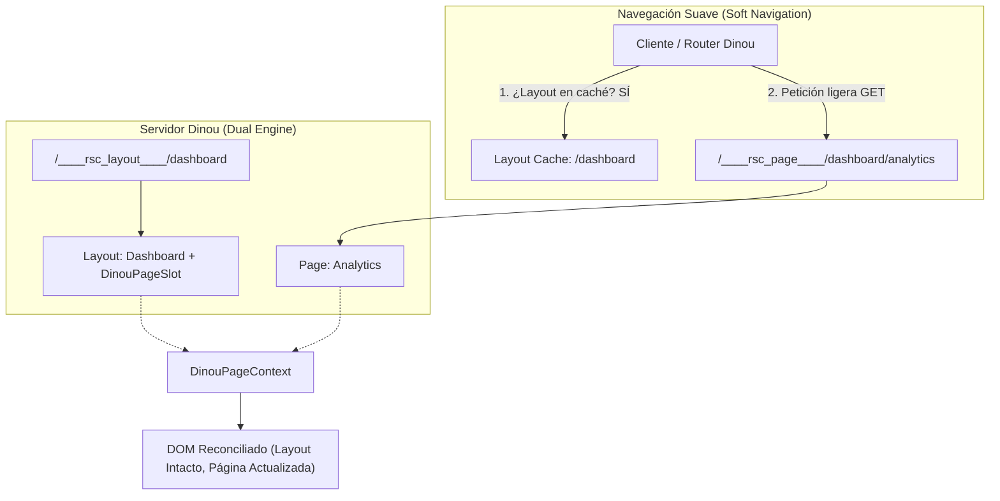
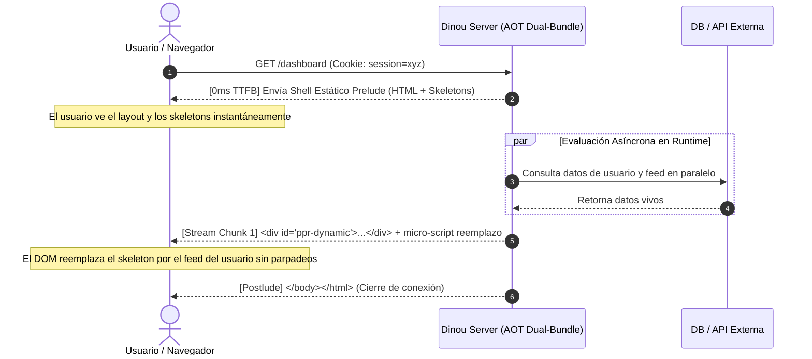
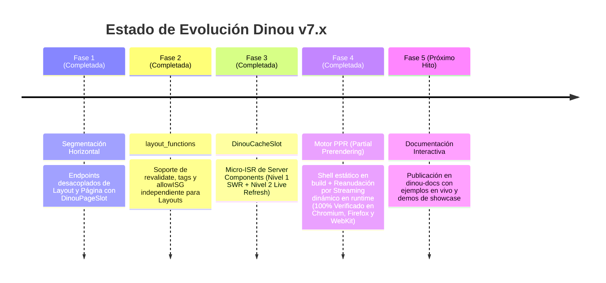

# Arquitectura Dinou v7: Segmentación, Resiliencia y Estado del Arte (PPR & Cache Slots)

> **Documento Técnico de Arquitectura y Visión de Futuro**  
> *Autor:* Dinou Core Team & Antigravity  
> *Fecha:* Octubre 2026  
> *Estado:* Segmentación Horizontal + `layout_functions` (100% Verificado) · Segmentación Vertical (`DinouCacheSlot` Nivel 1 y Nivel 2 Implementado y Verificado) · Partial Prerendering (PPR 100% Implementado y Verificado en Chromium, Firefox y WebKit)  

---

## 1. Introducción y Contexto Evolutivo

Dinou v7 nació como un framework fullstack basado en React Server Components (RSC) y arquitectura Dual-Bundle (0-fork) con soporte nativo para Node.js, Cloudflare Workers, Deno, Bun y Vercel. 

En sus primeras versiones, la navegación entre rutas funcionaba bajo un modelo **monolítico de página completa**: cada transición cliente solicitaba al servidor el árbol completo de componentes (`<Layout><Page /></Layout>`). Aunque este enfoque era sencillo y robusto para empezar, presentaba limitaciones fundamentales comparado con el estado del arte de la industria (Next.js App Router, Remix v2):
1. **Pérdida de estado en Layouts:** El árbol de Layout se volvía a evaluar en el servidor y a reconciliar en el cliente en cada clic de navegación.
2. **Transferencia innecesaria de bytes:** Rutas con layouts pesados (navbars con menús complejos, sidebars ricos, pies de página) volvían a transmitir el mismo payload una y otra vez.
3. **Acoplamiento de caché e ISR:** El ciclo de vida de los datos (`page_functions`, `revalidate`) estaba atado a la página, impidiendo que los layouts tuvieran su propia estrategia de refresco independiente.

A lo largo de este ciclo de trabajo, hemos transformado Dinou en una arquitectura **Segmentada por Capas y Prerenderizada Parcialmente**, implementando y verificando con éxito:
- **Segmentación Horizontal:** Desacoplamiento de Layouts (`____rsc_layout____`) y Páginas (`____rsc_page____`).
- **`layout_functions`:** ISR desacoplado, tags e ISG independiente para layouts.
- **Segmentación Vertical (`DinouCacheSlot`):** Micro-ISR a nivel de componente con SWR (Nivel 1) y refresco en vivo desde cliente sin recarga (Nivel 2).
- **Partial Prerendering (PPR):** Shell estático pre-renderizado a 0ms TTFB con streaming reanudable de huecos dinámicos en runtime ([ppr.md](file:///c:/Users/roggc/dev/my-dinou-apps/dinou-e2e/ppr.md)).

---

## 2. Segmentación Horizontal (Rutas y Layouts) — *Implementada y Verificada*

### 2.1. Arquitectura de Endpoints Desacoplados

La segmentación horizontal divide la aplicación en dos planos independientes:
- **Plano de Layout (`____rsc_layout____`):** Renderiza exclusivamente la carcasa del layout y sus slots paralelos (`@slot`), colocando un marcador dinámico (`<DinouPageSlot />`) donde residirá el contenido hijo.
- **Plano de Página (`____rsc_page____`):** Renderiza exclusivamente el componente hoja de la ruta activa (`<Page />`).



### 2.2. La Ranura de Página: `DinouPageSlot` y `DinouPageContext`

Para que el layout en el cliente no necesite conocer de antemano qué página se renderizará, creamos el componente cliente `DinouPageSlot` y su contexto `DinouPageContext`:

1. **En el servidor (Generación RSC):**  
   Cuando se procesa una petición de layout (`options.segment === "layout"`), el motor reemplaza el contenido de la página por la referencia de componente cliente `DinouPageSlot`.
2. **En el cliente (Consumo y Reconciliación):**  
   El router envuelve la ejecución en:
   ```jsx
   <DinouPageContext.Provider value={slotContextValue}>
     {layoutPromise ? use(layoutPromise) : use(pagePromise)}
   </DinouPageContext.Provider>
   ```
   `DinouPageSlot` consume este contexto y renderiza el payload de la página (`PageConsumer`) dentro de un `SlotErrorBoundary` dedicado.
3. **Preservación total del estado:**  
   Al navegar entre subrutas que comparten layout (por ejemplo, `/demo/page-a` a `/demo/page-b`), el layout **nunca se desmonta ni se re-ejecuta**. Los reproductores de medios continúan sonando, los acordeones permanecen abiertos y las entradas de texto en sidebars o barras de navegación conservan su valor.

### 2.3. Caché de Layouts Sensible a Query Strings (`searchPart`)

Muchos layouts dinámicos albergan slots paralelos condicionales o componentes que dependen de parámetros de búsqueda (`?tab=profile`, `?slot_crash=true`).  
- **Problema encontrado:** La caché inicial de layouts solo indexaba por `layoutKey` (`/error`), de modo que una navegación suave hacia `/error?slot_crash=true` reutilizaba el layout previo y no notificaba a los slots del cambio de parámetros.
- **Solución implementada:** Se expandió `getLayoutPayload(layoutKey, searchPart)` para que la clave de caché y la petición RSC incorporen `${layoutKey}${searchPart}`. Con esto, cualquier cambio en los query strings que deba afectar al layout se propaga en tiempo real.

---

## 3. Resiliencia, Aislamiento y Manejo de Errores en React 19

Durante las pruebas exhaustivas de la suite e2e en Windows (`npm run dev:esbuild`), descubrimos y resolvimos varias peculiaridades críticas de React 19 y del protocolo de streaming RSC:

### 3.1. Eliminación de Doble Envoltura HTML en SSR de Errores
- **Diagnóstico:** En `get-error-jsx.js`, la función `getErrorJSX` verificaba si la raíz del JSX devuelto era de tipo `"html"`. Al estar activo un layout de ruta (`<Layout><PageError /></Layout>`), el tipo de la raíz era la función `Layout`, no `"html"`. En consecuencia, el servidor envolvía el layout dentro de otro `<html><head><body>...</body></html>`, generando marcado HTML inválido (un `<html>` dentro de otro `<body>`). Esto provocaba fallos catastróficos de hidratación en React 19.
- **Corrección:** Se modificó la condición a:
  ```javascript
  if (!layoutApplied && !hasHtml) {
    // Solo encapsular en <html> si no se aplicó ningún layout previo y el componente no lo trae
  }
  ```
  De este modo, cuando el layout raíz está presente, el error se renderiza limpiamente en su ranura natural (`{children}` o `<DinouPageSlot />`), manteniendo el sidebar, la cabecera y el shell del documento interactivos.

### 3.2. El Comportamiento de `SuspenseException` en React 19
- **Diagnóstico:** Al implementar `SlotErrorRenderer` para cargar dinámicamente el `error.tsx` de una ruta durante un fallo en soft-navigation, envolvimos la llamada `use(errorPromise)` dentro de un bloque tradicional `try / catch`. En React 19, cuando una promesa pasada a `use()` está en estado pendiente, React **lanza una excepción interna de suspensión** (`Suspense Exception`) para interrumpir el renderizado y esperar el flujo de red.
- **Efecto adverso:** Nuestro `catch (e)` interceptaba esa excepción considerándola un error de código, lo que impedía que React suspendiera y caía de inmediato en la pantalla genérica de emergencia (`DefaultDevError`).
- **Ajuste:** Se extrajo la invocación de `use(errorPromise)` fuera del `try/catch`, delegando la captura de la suspensión en un límite nativo:
  ```jsx
  <Suspense fallback={null}>
    <SlotErrorRenderer error={this.state.error} reset={reset} />
  </Suspense>
  ```
  Permitiendo que React 19 complete la fase de espera y renderice la página de error personalizada sin parpadeos.

### 3.3. Reseteo de Error Boundaries sin Destruir el Árbol Sano
- **El reto:** Cuando ocurre un error en el cliente, el `SlotErrorBoundary` debe atraparlo. Al reiniciar la navegación, el boundary debe resetearse sin usar una prop `key` mutante que desmonte los componentes sanos de la página.
- **Arquitectura de dos niveles:**
  1. En condiciones normales (`hasError === false`): `SlotErrorBoundary` permanece montado y retiene la instancia de sus hijos.
  2. En condiciones de error (`hasError === true`): Se detecta cualquier navegación (incluyendo visitas a la misma URL para reiniciar) a través de un contador de navegación (`navCount` y `resetKey: ${route}::${navCount}`). En `componentDidUpdate`:
     ```javascript
     componentDidUpdate(prevProps) {
       if (this.state.hasError && (prevProps.resetKey !== this.props.resetKey || prevProps.pagePromise !== this.props.pagePromise)) {
         this.setState({ hasError: false, error: null });
       }
     }
     ```
  Esto garantiza **100% de persistencia de estado en páginas saludables** y **100% de recuperabilidad inmediata ante errores**.

---

## 4. `layout_functions` para ISR Desacoplado — *Implementado y Verificado*

### 4.1. Necesidad Arquitectónica Resuelta
Anteriormente, la orquestación de caché e ISR en Dinou estaba centralizada en `page_functions`.  
Con la segmentación horizontal, un layout `/tienda/layout.tsx` que contiene un menú de categorías compartido por 50 subpáginas necesitaba poder definir su propio TTL de revalidación y tags de invalidación independientes.

### 4.2. Especificación y Sintaxis Implementada
Se habilitó la declaración de funciones de control a nivel de layout mediante `layout.functions.js` / `layout.functions.ts` o exportaciones con nombre en `layout.tsx`:

```typescript
// src/dashboard/layout.functions.ts
export const revalidate = 3600; // Cachear el layout durante 1 hora
export const tags = ["dashboard-shell", "user-nav"];
export const allowISG = true;
```

### 4.3. Flujo en Servidor y Edge
1. **Resolución:** El manejador ejecuta `resolveLayoutFunctionsConfig(layoutPath, ...)` en paralelo con `resolvePageFunctionsConfig`.
2. **Caché en Storage:** El payload del layout (`layout.rsc`) y sus metadatos (`layout.metadata.json`) se almacenan bajo sus propias etiquetas y TTL en el Storage (`FileSystemStorage`, `CloudflareKVStorage`, `DenoKVStorage`, etc.).
3. **Invalidación selectiva:** Al llamar a `revalidateTag("dashboard-shell")` o `revalidateLayout("/dashboard")`:
   - El endpoint de layout se invalida.
   - **No se obliga a regenerar las 50 páginas hijas**, y viceversa.
   - Verificado con tests específicos de layout-level `allowISG(false)` e invalidación por tag.

---

## 5. Segmentación Vertical: `DinouCacheSlot` — *Implementado y Verificado (Nivel 1 & Nivel 2)*

### 5.1. Definición: Segmentación Horizontal vs. Vertical

| Dimensión | Enfoque | Granularidad | Beneficio Principal |
|---|---|---|---|
| **Horizontal** | Layouts vs. Páginas | Nivel de URL / Estructura | Preservación del shell de la aplicación y navegación instantánea. |
| **Vertical** | Estático vs. Dinámico dentro de la misma pantalla | Nivel de Componente / Ranura | TTFB de 0ms con datos en tiempo real sin sacrificar dinamismo. |

```
┌────────────────────────────────────────────────────────┐
│  Layout (Segmentación Horizontal - Caché fija)        │
│  ┌──────────────────────────────────────────────────┐  │
│  │  Página: Shell Estático / Dinámico               │  │
│  │  "Panel de Control"                              │  │
│  │  ┌────────────────────┐  ┌────────────────────┐  │  │
│  │  │ DinouCacheSlot     │  │ DinouCacheSlot     │  │  │
│  │  │ (Micro-ISR / SWR)  │  │ (Live Refreshable) │  │  │
│  │  │ slot-alpha         │  │ slot-beta          │  │  │
│  │  │ revalidate: 60s    │  │ tag: tag-beta      │  │  │
│  │  └────────────────────┘  └────────────────────┘  │  │
│  └──────────────────────────────────────────────────┘  │
└────────────────────────────────────────────────────────┘
```

### 5.2. Los Dos Niveles de DinouCacheSlot

`DinouCacheSlot` opera en dos niveles complementarios:

#### Nivel 1: Micro-ISR de Server Components & SWR
* Los Server Components envueltos en `<DinouCacheSlot id="slot-alpha" tag="tag-alpha" revalidate={60}>` se evalúan y se almacenan como fragmentos serializados JSX en `slots/:id/slot.json`.
* **Stale-While-Revalidate (SWR):** Cuando el TTL expira, la siguiente petición recibe inmediatamente el contenido previo mientras una promesa en segundo plano (`waitUntil`) regenera y actualiza el slot en Storage (`FileSystemStorage`, `CloudflareKVStorage`, `DenoKVStorage` o `MemoryStorage`).
* **Invalidación Granular por Tag:** Al ejecutar `revalidateTag("tag-alpha")` en una Server Action, únicamente el slot afectado es purgado de la caché. Los slots hermanos y la página mantienen sus datos intactos.

#### Nivel 2: Refresco en Vivo sin Recarga de Página
* Los slots se envuelven automáticamente en un componente cliente boundary (`DinouCacheSlotBoundary`).
* Mediante las funciones públicas de cliente:
  ```tsx
  import { refreshSlot, useRouter } from "dinou";

  // Función directa
  await refreshSlot("slot-alpha");

  // O a través del hook useRouter()
  const router = useRouter();
  await router.refreshSlot("slot-beta");
  ```
* El cliente solicita el fragmento actualizado al endpoint dedicado `/____rsc_slot____/:id`.
* **Cero recarga de página y cero re-render de hermanos:** React actualiza exclusivamente el subárbol DOM correspondiente al slot refrescado. El timestamp de la página y de los slots hermanos se mantiene inmutable.

#### Ejemplo de Implementación Integral

```tsx
// src/dashboard/page.tsx (Server Component)
import { DinouCacheSlot } from "dinou/server";
import { MetricWidget, LiveActivityWidget } from "./widgets";
import DashboardControls from "./DashboardControls";

export default async function DashboardPage() {
  const pageTime = Date.now();

  return (
    <main>
      <h1>Panel de Control</h1>
      <p>Render de Página: {pageTime}</p>

      {/* Nivel 1: Micro-ISR con TTL de 60s e invalidación por tag */}
      <DinouCacheSlot id="slot-metricas" tag="tag-metricas" revalidate={60}>
        <MetricWidget />
      </DinouCacheSlot>

      {/* Nivel 2: Slot listo para refresco en vivo sin reload */}
      <DinouCacheSlot id="slot-actividad" tag="tag-actividad">
        <LiveActivityWidget />
      </DinouCacheSlot>

      <DashboardControls />
    </main>
  );
}
```

```tsx
// src/dashboard/DashboardControls.tsx (Client Component)
"use client";
import { refreshSlot, useRouter } from "dinou";
import { invalidarMetricasAction } from "./actions";

export default function DashboardControls() {
  const router = useRouter();

  return (
    <div>
      {/* Nivel 1: Invalidación en servidor vía Server Action */}
      <button onClick={() => invalidarMetricasAction()}>
        Invalidar Métricas (Server Tag)
      </button>

      {/* Nivel 2: Refresco en cliente sin tocar la página */}
      <button onClick={() => refreshSlot("slot-actividad")}>
        Actualizar Actividad (Live Slot)
      </button>
      
      {/* O vía router */}
      <button onClick={() => router.refreshSlot("slot-actividad")}>
        Actualizar con useRouter
      </button>
    </div>
  );
}
```

### 5.3. Serialización JSX Nativa de React 19
En [dinou/core/cache-slot.js](file:///c:/Users/roggc/dev/my-dinou-apps/dinou-e2e/dinou/core/cache-slot.js) se implementó un motor especializado de serialización y deserialización que soporta:
- Símbolos de React 19 (`Symbol.for("react.transitional.element")`).
- Referencias de componentes cliente (`Symbol.for("react.client.reference")`).
- Reconstrucción fiel de árboles JSX y props anidadas.

---

## 6. Partial Prerendering (PPR) — *Implementado y Verificado*

### 6.1. ¿Qué es PPR y por qué revoluciona Dinou?

Históricamente, los frameworks de renderizado web forzaban una decisión binaria por ruta:
- **SSG (Static Site Generation):** Entrega inmediata (0ms TTFB) desde CDN/almacenamiento, pero completamente rígido. Incapaz de leer cookies de sesión, cabeceras de autenticación o datos vivos de bases de datos en el servidor.
- **SSR (Server-Side Rendering):** Capaz de procesar datos dinámicos por petición, pero su Time to First Byte (TTFB) se degrada irremediablemente: el servidor no envía el primer byte hasta que la consulta a la base de datos o API externa más lenta concluye.

**Partial Prerendering (PPR) en Dinou v7.2 unifica ambos paradigmas en una sola ruta:**
1. **En tiempo de compilación (Build Time / SSG):** Dinou genera una cáscara estática (`shell.html` y `shell.rsc`) que contiene todos los elementos estáticos (layouts, cabeceras, títulos, sidebars) y los esqueletos de carga de los límites `<Suspense>`.
2. **En tiempo de ejecución (Runtime / 0ms TTFB):** El servidor entrega **inmediatamente** la cáscara estática a la CDN o al cliente.
3. **Reanudación Streaming en paralelo:** La conexión HTTP se mantiene abierta. En el servidor, los componentes dinámicos dentro de `<Suspense>` se evalúan en paralelo con la información real de la petición (`cookies`, `query`, `headers`). En cuanto cada componente resuelve sus datos, el servidor empuja un chunk HTML por streaming con un script atómico que sustituye el esqueleto por el contenido final en el DOM.



---

### 6.2. Guía de Uso para Desarrolladores (DX)

Usar PPR en Dinou es completamente intuitivo y no requiere APIs complejas ni wrappers propietarios:

#### Paso 1: Declarar PPR en Rutas o Heredar desde Layouts

En Dinou v7.2 existen dos modalidades para activar Partial Prerendering:

1. **Declaración explícita a nivel de Página:**
   En cualquier archivo `page.tsx` (o `page.jsx`), exporta la constante `ppr = true`:
   ```tsx
   // src/dashboard/page.tsx
   export const ppr = true; // También compatible: export const experimental_ppr = true;
   ```

2. **Herencia en Cascada a nivel de Layout:**
   Puedes habilitar PPR para toda una sección o sub-árbol de la aplicación declarando `ppr = true` directamente en un `layout.tsx` (o en su archivo complementario `layout_functions.ts`):
   ```tsx
   // src/dashboard/layout.tsx
   export const ppr = true;

   export default function DashboardLayout({ children }: { children: React.ReactNode }) {
     return (
       <div className="dashboard-shell">
         <aside className="static-sidebar">Menú Dashboard</aside>
         <main>{children}</main>
       </div>
     );
   }
   ```
   *Efecto de cascada:* Todas las páginas hijas y layouts anidados bajo `/dashboard/*` heredarán automáticamente el modo PPR sin necesidad de declarar `export const ppr = true;` en cada una de ellas.

3. **Opt-Out Granular (`ppr = false`):**
   Si una página específica dentro de un sub-árbol PPR necesita renderizarse bajo el modelo SSR dinámico tradicional o SSG completo sin streaming de huecos, puede desactivar la herencia explícitamente:
   ```tsx
   // src/dashboard/reports/page.tsx
   // Desactiva PPR para esta página concreta dentro de un layout con PPR activo
   export const ppr = false;
   ```

#### Paso 2: Aislar los componentes dinámicos con `<Suspense>`
Dinou analizará el árbol de componentes. Todo lo que esté fuera de `<Suspense>` formará parte del shell estático. Cualquier componente asíncrono que acceda al contexto de petición (`cookies`, `query`, `headers`, `getContext()`) debe envolverse en un `<Suspense>` con un `fallback`:

```tsx
// src/dashboard/page.tsx
import React, { Suspense } from "react";
import { getContext } from "dinou";

export const ppr = true;

// Componente Dinámico: Se ejecuta en el servidor por petición (Runtime)
async function UserGreeting() {
  const ctx = getContext();
  const userName = ctx?.req?.cookies?.username || ctx?.req?.query?.user || "Invitado";

  // Llamada asíncrona a base de datos o servicio externo
  await new Promise((resolve) => setTimeout(resolve, 80));

  return (
    <div className="card-user">
      <h2>¡Hola de nuevo, <span className="highlight">{userName}</span>!</h2>
      <p>Tu resumen de actividad está actualizado.</p>
    </div>
  );
}

// Esqueleto de Carga: Se compila dentro del shell estático (Build Time)
function GreetingSkeleton() {
  return (
    <div className="skeleton card-user">
      <div className="skeleton-title">Cargando perfil...</div>
    </div>
  );
}

export default function DashboardPage() {
  return (
    <div className="dashboard-container">
      {/* 🚀 Shell Estático: Servido a 0ms TTFB desde CDN/Memoria */}
      <header>
        <h1>Panel de Métricas</h1>
        <p>Este encabezado y la estructura general son 100% estáticos.</p>
      </header>

      {/* ⚡ Hueco Dinámico: Se reemplaza en streaming progresivo */}
      <Suspense fallback={<GreetingSkeleton />}>
        <UserGreeting />
      </Suspense>
    </div>
  );
}
```

#### Paso 3: Experiencia en Navegación y Conciliación SPA (React 19)
- **Carga Inicial Directa (Full Page Load):**  
  El navegador recibe el shell preliminar al instante (0ms). En cuanto el servidor termina de evaluar `UserGreeting`, el fragmento final se inserta en el DOM en su ranura exacta mediante un micro-script inyectado en streaming:
  ```javascript
  (function(){
    var c = document.getElementById("ppr-content-ppr-hole-1");
    if (!c) return;
    var t = document.querySelector('[data-ppr-hole="ppr-hole-1"]');
    try {
      if (t) { t.replaceWith(c.content ? c.content : ...c.childNodes); }
    } finally {
      c.remove();
    }
  })();
  ```
- **Hidratación y Navegación Suave (SPA):**  
  Durante la hidratación cliente de React 19, Dinou inyecta `window.__DINOU_PPR__ = true` y desactiva el fetching de RSC estático (`window.__DINOU_USE_STATIC__ = false`). Cuando el router cliente reconcilia la página o cuando el usuario navega a través de enlaces `<Link href="/dashboard">`, el endpoint `/____rsc_page____/dashboard` evalúa dinámicamente el componente con las cookies y parámetros actuales, garantizando que **nunca se sobrescriban los datos del usuario con los valores de compilación**.

---

### 6.3. Arquitectura Interna del Motor PPR (Dinou Core)

La implementación se diseñó meticulosamente para integrarse con la arquitectura Dual-Bundle AOT in-memory de Dinou:

1. **Detección AST Tri-Estado y Enrutador (`parse-exports.js`, `route-generator.js`):**
   El analizador estático inspecciona las exportaciones de páginas y layouts distinguiendo tres estados: `true` (activación), `false` (opt-out explícito) y `null` (herencia / no declarado). Registra `{ ppr: Boolean(isPpr) }` en los metadatos de rutas (`__DINOU_ROUTE_METADATA__` y `dist2/metadata.json`).

2. **Resolución Jerárquica en Cascada con Opt-Out (`handler.js`, `build-static-pages.js`, `layout-functions.js`):**
   Tanto en la fase de construcción SSG (`resolveBuildPprForRoute`) como en runtime HTTP (`resolvePprForRoute`):
   - Se recorre la cadena de layouts ancestros de la ruta activa desde el Layout Raíz hasta el Layout más profundo.
   - Si algún layout define `ppr: true`, el flag se hereda hacia los descendientes. Si un layout anidado define `ppr: false`, desactiva el flag para su rama.
   - Finalmente, si la página hoja define explícitamente `ppr: true` o `ppr: false`, su valor tiene prioridad absoluta, permitiendo un opt-out o opt-in granular.

3. **Detección de Aplazamiento en Build Time (`ppr-context.js`, `bailout-proxy.js`):**
   Durante la fase de compilación estática (`buildStaticPages`):
   - Se activa un contexto especial `runWithPprContext({ isPpr: true })`.
   - Si un componente dentro de un límite Suspense intenta leer `req.cookies`, `req.headers` o `req.query`, los proxies espía de `createBailoutProxy` detectan el acceso dinámico y lanzan `Symbol.for("dinou.ppr.postpone")`.
   - `renderJSXToClientJSX` captura este símbolo, registra el hueco dinámico (`ppr-hole-1`) y emite en su lugar el fallback envuelto con `<div data-ppr-hole="ppr-hole-1" style="display:contents">`.
   - Se guardan los artefactos base: `shell.html`, `shell.rsc` y `metadata.json` con la lista de huecos registrados.

4. **Motor de Reanudación Streaming en Runtime (`ppr-runtime.js`):**
   Cuando un usuario solicita una ruta PPR (`handleRequest` en `handler.js`):
   - `handlePprResume` divide el `shell.html` en preludio (hasta antes de `</body>`) y postludio.
   - Envía inmediatamente el preludio al stream HTTP mediante `writer.write(encoder.encode(shellPrelude))` logrando 0ms TTFB.
   - En paralelo, `streamDynamicHoles` recorre el árbol JSX de la página ejecutando los Server Components reales con el `requestContext` de la petición viva.
   - Para generar el HTML de los huecos dinámicos respetando las restricciones de React Server Components (donde `react-dom/server` no puede importarse dentro de `react-server`), el motor pasa el stream RSC por `platformContext.renderHtmlStream` (Pass B SSR Engine).
   - Escribe el chunk de contenido dinámico y el script de reemplazo atómico en la conexión abierta, cerrando el stream con el postludio `</body></html>`.

5. **Endpoint Dinámico de RSC (`handler.js`):**
   En el endpoint de páginas RSC `/____rsc_page____`:
   - El servidor comprueba si la ruta tiene activa la bandera PPR resuelta (`isRoutePpr`).
   - Si es PPR, **bloquea la entrega del payload estático precompilado** `page.rsc`, canalizando la solicitud directamente hacia la generación en vivo con el contexto del usuario.

---

### 6.4. Batería de Pruebas E2E y Validación Multi-Navegador

La suite en [e2e/example.spec.ts](file:///c:/Users/roggc/dev/my-dinou-apps/dinou-e2e/e2e/example.spec.ts) valida de forma exhaustiva tanto PPR directo como herencia y opt-out:

- **Rutas de prueba:**
  - [src/t-ppr/page.tsx](file:///c:/Users/roggc/dev/my-dinou-apps/dinou-e2e/src/t-ppr/page.tsx): Declaración directa `export const ppr = true;` en página.
  - [src/t-ppr-layout/layout.tsx](file:///c:/Users/roggc/dev/my-dinou-apps/dinou-e2e/src/t-ppr-layout/layout.tsx): Declaración `export const ppr = true;` a nivel de Layout.
  - [src/t-ppr-layout/page.tsx](file:///c:/Users/roggc/dev/my-dinou-apps/dinou-e2e/src/t-ppr-layout/page.tsx): Página sin declaración de PPR que hereda el comportamiento del Layout.
  - [src/t-ppr-layout/opt-out/page.tsx](file:///c:/Users/roggc/dev/my-dinou-apps/dinou-e2e/src/t-ppr-layout/opt-out/page.tsx): Página hija con `export const ppr = false;` que desactiva PPR puntualmente.
- **Casos de prueba verificados al 100%:**
  1. *Carga inicial directa:* El shell estático (`#ppr-static-title`, `#ppr-static-desc`) se visualiza de forma inmediata y el hueco dinámico resuelve con el valor por defecto (`Alice`).
  2. *Personalización por Cookies:* Petición con cookie `username=Charlie`. El shell estático se mantiene intacto y el hueco dinámico refleja `"Charlie"`.
  3. *Personalización por Parámetros de Búsqueda:* Petición con query string `?user=David`. El hueco dinámico refleja `"David"`.
  4. *Herencia en Cascada desde Layout:* Ruta `/t-ppr-layout?user=InheritedChild` renderiza el shell estático de layout y página, y resuelve el hueco dinámico vía streaming con `"InheritedChild"`.
  5. *Opt-Out Explícito:* Ruta `/t-ppr-layout/opt-out` renderiza como SSR tradicional respetando `ppr = false` sin aplazar componentes en build time.
- **Ejecución concurrente:** **15 tests** ejecutados en paralelo sobre **Chromium**, **Firefox** y **WebKit**, aprobados al 100%.

---

## 7. Tabla Comparativa de Estrategias en Dinou

| Capacidad | Dinou v6 (Anterior) | Dinou v7 (Actual) | Dinou v7.2 (PPR Implementado) |
|---|---|---|---|
| **Granularidad de Navegación** | Monolítica (Página entera) | Segmentada Horizontal (Layouts vs Páginas) | Segmentada Horizontal + Vertical (PPR + Slots) |
| **Persistencia de Layouts en SPA** | Parcial / Re-evaluada | 100% Preservada (0 re-evaluaciones) | 100% Preservada |
| **Caché en Layouts** | No disponible | Completa (`layout_functions`, revalidate, tags) | Completa |
| **Micro-ISR por Componente** | No disponible | Implementado (`DinouCacheSlot` Nivel 1 & 2) | Integrado con PPR |
| **Refresco en Vivo de Slots** | No disponible | Implementado (`refreshSlot`, `useRouter`) | Implementado |
| **TTFB en Rutas Dinámicas** | Depende del SSR más lento | Rápido (Layouts cacheados) | Ultrarrápido (Shell estático 0ms + Stream) |
| **Aislamiento de Errores** | Pantalla global / Full reload | Localizada en Slot o Layout con rescate SPA | Localizada a nivel de Componente/Slot/Boundary |
| **Compatibilidad React 19** | Básica | Completa (use, Server Actions, Transitions) | Nativa con Streaming Reanudable |

---

## 8. Hoja de Ruta Actualizada (Roadmap)



> La especificación técnica inicial y análisis preliminar del **Motor PPR** se preserva como referencia en [ppr.md](file:///c:/Users/roggc/dev/my-dinou-apps/dinou-e2e/ppr.md).
