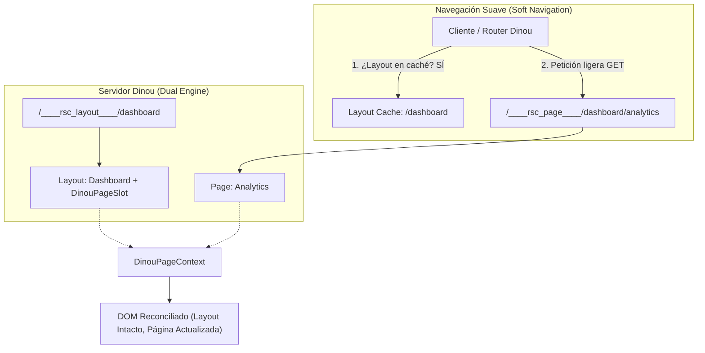
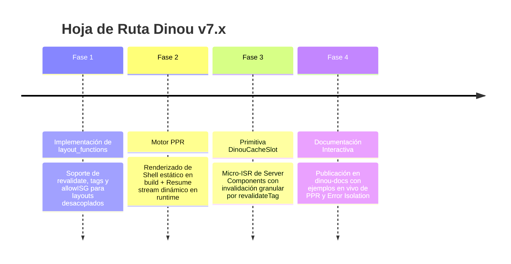

# Arquitectura Dinou v7: Segmentación, Resiliencia y Estado del Arte (PPR & Cache Slots)

> **Documento Técnico de Arquitectura y Visión de Futuro**  
> *Autor:* Dinou Core Team & Antigravity  
> *Fecha:* Octubre 2026  
> *Estado:* Segmentación Horizontal Implementada (100% Tests Verificados) · Segmentación Vertical & PPR en Roadmap  

---

## 1. Introducción y Contexto Evolutivo

Dinou v7 nació como un framework fullstack basado en React Server Components (RSC) y arquitectura Dual-Bundle (0-fork) con soporte nativo para Node.js, Cloudflare Workers, Deno, Bun y Vercel. 

En sus primeras versiones, la navegación entre rutas funcionaba bajo un modelo **monolítico de página completa**: cada transición cliente solicitaba al servidor el árbol completo de componentes (`<Layout><Page /></Layout>`). Aunque este enfoque era sencillo y robusto para empezar, presentaba limitaciones fundamentales comparado con el estado del arte de la industria (Next.js App Router, Remix v2):
1. **Pérdida de estado en Layouts:** El árbol de Layout se volvía a evaluar en el servidor y a reconciliar en el cliente en cada clic de navegación.
2. **Transferencia innecesaria de bytes:** Rutas con layouts pesados (navbars con menús complejos, sidebars ricos, pies de página) volvían a transmitir el mismo payload una y otra vez.
3. **Acoplamiento de caché e ISR:** El ciclo de vida de los datos (`page_functions`, `revalidate`) estaba atado a la página, impidiendo que los layouts tuvieran su propia estrategia de refresco independiente.

A lo largo de este ciclo de trabajo, hemos transformado Dinou en una arquitectura **Segmentada por Capas**, resolviendo todos los desafíos de estabilidad en tiempo de ejecución, compatibilidad con React 19 y gestión de errores. Este documento recopila todos los hallazgos técnicos, soluciones aplicadas y el diseño para las próximas dos fases: **`layout_functions`** y **Segmentación Vertical (PPR & `DinouCacheSlot`)**.

---

## 2. Segmentación Horizontal (Rutas y Layouts) — *Implementada*

### 2.1. Arquitectura de Endpoints Desacoplados

La segmentación horizontal divide la aplicación en dos planos independientes:
- **Plano de Layout (`____rsc_layout____`):** Renderiza exclusivamente la carcasa del layout y sus slots paralelos (`@slot`), colocando un marcador dinámico (`<DinouPageSlot />`) donde residirá el contenido hijo.
- **Plano de Página (`____rsc_page____`):** Renderiza exclusivamente el componente hoja de la ruta activa (`<Page />`).



### 2.2. La Ranura de Página: `DinouPageSlot` y `DinouPageContext`

Para que el layout en el cliente no necesite conocer de antemano qué página se renderizará, creamos el componente cliente `DinouPageSlot` y su contexto `DinouPageContext`:

1. **En el servidor (Generación RSC):**  
   Cuando se procesa una petición de layout (`options.segment === "layout"`), el motor reemplaza el contenido de la página por la referencia de componente cliente `DinouPageSlot`.
2. **En el cliente (Consumo y Reconciliación):**  
   El router envuelve la ejecución en:
   ```jsx
   <DinouPageContext.Provider value={slotContextValue}>
     {layoutPromise ? use(layoutPromise) : use(pagePromise)}
   </DinouPageContext.Provider>
   ```
   `DinouPageSlot` consume este contexto y renderiza el payload de la página (`PageConsumer`) dentro de un `SlotErrorBoundary` dedicado.
3. **Preservación total del estado:**  
   Al navegar entre subrutas que comparten layout (por ejemplo, `/demo/page-a` a `/demo/page-b`), el layout **nunca se desmonta ni se re-ejecuta**. Los reproductores de medios continúan sonando, los acordeones permanecen abiertos y las entradas de texto en sidebars o barras de navegación conservan su valor.

### 2.3. Caché de Layouts Sensible a Query Strings (`searchPart`)

Muchos layouts dinámicos albergan slots paralelos condicionales o componentes que dependen de parámetros de búsqueda (`?tab=profile`, `?slot_crash=true`).  
- **Problema encontrado:** La caché inicial de layouts solo indexaba por `layoutKey` (`/error`), de modo que una navegación suave hacia `/error?slot_crash=true` reutilizaba el layout previo y no notificaba a los slots del cambio de parámetros.
- **Solución implementada:** Se expandió `getLayoutPayload(layoutKey, searchPart)` para que la clave de caché y la petición RSC incorporen `${layoutKey}${searchPart}`. Con esto, cualquier cambio en los query strings que deba afectar al layout se propaga en tiempo real.

---

## 3. Resiliencia, Aislamiento y Manejo de Errores en React 19

Durante las pruebas exhaustivas de la suite e2e en Windows (`npm run dev:esbuild`), descubrimos y resolvimos varias peculiaridades críticas de React 19 y del protocolo de streaming RSC:

### 3.1. Eliminación de Doble Envoltura HTML en SSR de Errores
- **Diagnóstico:** En `get-error-jsx.js`, la función `getErrorJSX` verificaba si la raíz del JSX devuelto era de tipo `"html"`. Al estar activo un layout de ruta (`<Layout><PageError /></Layout>`), el tipo de la raíz era la función `Layout`, no `"html"`. En consecuencia, el servidor envolvía el layout dentro de otro `<html><head><body>...</body></html>`, generando marcado HTML inválido (un `<html>` dentro de otro `<body>`). Esto provocaba fallos catastróficos de hidratación en React 19.
- **Corrección:** Se modificó la condición a:
  ```javascript
  if (!layoutApplied && !hasHtml) {
    // Solo encapsular en <html> si no se aplicó ningún layout previo y el componente no lo trae
  }
  ```
  De este modo, cuando el layout raíz está presente, el error se renderiza limpiamente en su ranura natural (`{children}` o `<DinouPageSlot />`), manteniendo el sidebar, la cabecera y el shell del documento interactivos.

### 3.2. El Comportamiento de `SuspenseException` en React 19
- **Diagnóstico:** Al implementar `SlotErrorRenderer` para cargar dinámicamente el `error.tsx` de una ruta durante un fallo en soft-navigation, envolvimos la llamada `use(errorPromise)` dentro de un bloque tradicional `try / catch`. En React 19, cuando una promesa pasada a `use()` está en estado pendiente, React **lanza una excepción interna de suspensión** (`Suspense Exception`) para interrumpir el renderizado y esperar el flujo de red.
- **Efecto adverso:** Nuestro `catch (e)` interceptaba esa excepción considerándola un error de código, lo que impedía que React suspendiera y caía de inmediato en la pantalla genérica de emergencia (`DefaultDevError`).
- **Ajuste:** Se extrajo la invocación de `use(errorPromise)` fuera del `try/catch`, delegando la captura de la suspensión en un límite nativo:
  ```jsx
  <Suspense fallback={null}>
    <SlotErrorRenderer error={this.state.error} reset={reset} />
  </Suspense>
  ```
  Permitiendo que React 19 complete la fase de espera y renderice la página de error personalizada sin parpadeos.

### 3.3. Reseteo de Error Boundaries sin Destruir el Árbol Sano
- **El reto:** Cuando ocurre un error en el cliente (por ejemplo, un componente interactivo lanza una excepción en render), el `SlotErrorBoundary` debe atraparlo. Si el usuario pulsa un botón de reintento o un enlace a la misma ruta (`<a href="/error">Reset Demo Page</a>`), el boundary debe resetearse. Sin embargo, no se debe utilizar una prop `key` mutante (`key={route}`) en el boundary sano, porque cambiar la clave obligaría a React a **desmontar todos los componentes de la página**, borrando inputs de formularios y contadores de estado local en navegaciones normales o recargas suaves (`router.refresh()`).
- **Arquitectura de dos niveles:**
  1. En condiciones normales (`hasError === false`): `SlotErrorBoundary` permanece montado y retiene la instancia de sus hijos.
  2. En condiciones de error (`hasError === true`): Se detecta cualquier navegación (incluyendo visitas a la misma URL para reiniciar) a través de un contador de navegación (`navCount` y `resetKey: ${route}::${navCount}`). En `componentDidUpdate`:
     ```javascript
     componentDidUpdate(prevProps) {
       if (this.state.hasError && (prevProps.resetKey !== this.props.resetKey || prevProps.pagePromise !== this.props.pagePromise)) {
         this.setState({ hasError: false, error: null });
       }
     }
     ```
  Esto garantiza **100% de persistencia de estado en páginas saludables** y **100% de recuperabilidad inmediata ante errores**.

---

## 4. El Próximo Hito: `layout_functions` para ISR Desacoplado

### 4.1. Necesidad Arquitectónica
Hasta ahora, la orquestación de caché e ISR en Dinou ha estado centralizada en `page_functions` (definidas en `page.functions.js` o exportadas desde `page.tsx`).  
Con la segmentación horizontal en marcha, esto produce una asimetría:
- Si una ruta `/tienda/calzado` tiene una página estática o dinámica, pero su layout `/tienda/layout.tsx` contiene un catálogo de categorías compartido por 50 subpáginas, el layout debería poder definir su propia política de revalidación.

### 4.2. Especificación de Diseño de `layout_functions`
Se habilitará la declaración de funciones de control a nivel de layout:
- Archivo complementario: `layout.functions.js` / `layout.functions.ts`, o exportaciones con nombre en `layout.tsx`:
  ```typescript
  // src/dashboard/layout.functions.ts
  export const revalidate = 3600; // Cachear el layout durante 1 hora
  export const tags = ["dashboard-shell", "user-nav"];
  export const allowISG = true;
  ```

### 4.3. Flujo en Servidor y Edge
1. **Resolución:** El manejador ejecuta `resolveLayoutFunctionsConfig(layoutPath, ...)` en paralelo con `resolvePageFunctionsConfig`.
2. **Caché en KV / Storage:** El payload del layout (`layout.rsc`) se almacena bajo su propia etiqueta y TTL en el almacenamiento Edge.
3. **Invalidación selectiva:** Al llamar a `revalidateTag("dashboard-shell")`, el endpoint de layout se invalida **sin obligar a regenerar las 50 páginas hijas**, y viceversa.

---

## 5. Segmentación Vertical y PPR (Partial Pre-Rendering)

### 5.1. Definición: Segmentación Horizontal vs. Vertical

| Dimensión | Enfoque | Granularidad | Beneficio Principal |
|---|---|---|---|
| **Horizontal** | Layouts vs. Páginas | Nivel de URL / Estructura | Preservación del shell de la aplicación y navegación instantánea. |
| **Vertical** | Estático vs. Dinámico dentro de la misma pantalla | Nivel de Componente / Ranura | TTFB de 0ms con datos en tiempo real sin sacrificar dinamismo. |

```
┌────────────────────────────────────────────────────────┐
│  Layout (Segmentación Horizontal - Caché fija)        │
│  ┌──────────────────────────────────────────────────┐  │
│  │  Página: Shell Estático (PPR - Build Time)       │  │
│  │  "Bienvenido a la tienda"                        │  │
│  │  ┌────────────────────┐  ┌────────────────────┐  │  │
│  │  │ DinouCacheSlot     │  │ DinouCacheSlot     │  │  │
│  │  │ (Estático / ISR)   │  │ (Dinámico / Edge)  │  │  │
│  │  │ Productos Populares│  │ Saldo Usuario      │  │  │
│  │  │ revalidate: 600s   │  │ revalidate: 0s     │  │  │
│  │  └────────────────────┘  └────────────────────┘  │  │
│  └──────────────────────────────────────────────────┘  │
└────────────────────────────────────────────────────────┘
```

### 5.2. ¿Cómo funciona PPR (Partial Pre-Rendering) en Dinou?

El concepto de PPR busca lo mejor de dos mundos:
1. **La velocidad del SSG (Static Site Generation):** Servir inmediatamente desde la CDN más cercana un archivo HTML pre-renderizado con TTFB cercano a 0ms.
2. **La frescura del SSR (Server-Side Rendering):** Cargar la información personalizada del usuario (carrito, perfil, recomendaciones en vivo) sin bloquear la primera pintura.

#### El Mecanismo Técnico:
- **Paso 1 (En tiempo de Build):** Dinou renderiza la página simulando que los datos dinámicos están pendientes. Todo lo que esté fuera de `<Suspense>` se consolida en el archivo estático HTML y en el RSC inicial (`page.rsc`). Dentro de los huecos suspendidos, se inyectan los fallbacks estáticos (esqueletos de carga / skeletons).
- **Paso 2 (Primer Byte en Edge/Runtime):** La CDN devuelve inmediatamente el HTML estático. El usuario ve la página al instante.
- **Paso 3 (Reanudación del Stream RSC en Edge):** Simultáneamente, el runtime de Dinou en el Edge ejecuta las promesas de los Server Components que quedaron suspendidos, y empieza a emitir los chunks RSC por la conexión abierta de streaming.
- **Paso 4 (Inserción sin recarga):** El cliente de Dinou recibe los trozos del stream y React rellena los esqueletos con los datos dinámicos reales sin parpadeos ni navegación adicional.

---

## 6. `DinouCacheSlot`: La Primitiva de Caché Vertical por Componente

### 6.1. ¿Por qué `DinouCacheSlot` supera al PPR tradicional?

El PPR convencional está acoplado al momento del despliegue (build time): decide qué es estático y qué es dinámico antes de subir a producción.  
Sin embargo, en aplicaciones reales existen necesidades que van más allá del build time:
- ¿Qué pasa si una página es **100% dinámica en SSR** (por ejemplo, `/feed`), pero dentro de ella hay un widget del tiempo o una lista de tendencias que solo cambia cada 10 minutos?
- En el PPR clásico, tendrías que re-evaluar ese widget en cada petición al Edge o usar un `fetch` cacheado a nivel de función de datos.

`DinouCacheSlot` es una primitiva a **nivel de componente** que gestiona su propio ciclo de vida e invalidación independientemente de si la página contenedora es estática o dinámica.

### 6.2. Ejemplo de API Propuesta

```tsx
import { DinouCacheSlot } from "dinou/server";
import { Suspense } from "react";
import TrendingTopics from "@/components/trending";
import UserBalance from "@/components/user-balance";
import ProductCatalog from "@/components/catalog";

export default async function DashboardPage() {
  return (
    <div className="space-y-6">
      {/* 1. Shell Estático Inmediato */}
      <h1>Panel de Control</h1>

      {/* 2. Micro-ISR dentro de página: Caché de 5 minutos con tags */}
      <Suspense fallback={<TrendingSkeleton />}>
        <DinouCacheSlot 
          tag="trending-topics" 
          revalidate={300}
        >
          <TrendingTopics />
        </DinouCacheSlot>
      </Suspense>

      {/* 3. Slot de consulta pesada cacheada por 1 hora */}
      <Suspense fallback={<CatalogSkeleton />}>
        <DinouCacheSlot 
          tag="featured-products" 
          revalidate={3600}
        >
          <ProductCatalog category="tech" />
        </DinouCacheSlot>
      </Suspense>

      {/* 4. Slot completamente dinámico en tiempo real (revalidate: 0) */}
      <Suspense fallback={<BalanceSkeleton />}>
        <UserBalance />
      </Suspense>
    </div>
  );
}
```

### 6.3. Diferencias entre Escenarios de Uso

1. **Uso en Páginas Pre-renderizadas en Build (SSG/PPR):**
   - El compilador resuelve el slot estático en el build.
   - En runtime, si el slot expira (`revalidate`), Dinou aplica **Micro-ISR**: regenera únicamente el sub-árbol RSC del slot en segundo plano en el Edge Storage (KV), sin reconstruir la página completa ni re-renderizar los layouts.
2. **Uso en Páginas Dinámicas (SSR en Runtime):**
   - La página se ejecuta dinámicamente en cada petición para atender datos sensibles (sesiones, cookies).
   - Sin embargo, los componentes envueltos en `DinouCacheSlot` no tocan la base de datos ni consumen cómputo: se leen directamente del almacenamiento de caché del Edge como fragmentos RSC precalculados.
3. **Invalidación Quirúrgica por Etiquetas:**
   ```typescript
   // En una Server Function o Webhook de CMS:
   import { revalidateTag } from "dinou/server";

   export async function updateCatalog() {
     await db.products.update(...);
     // Solo invalida el slot del catálogo en los bordes de la red
     await revalidateTag("featured-products");
   }
   ```

---

## 7. Tabla Comparativa de Estrategias en Dinou

| Capacidad | Dinou v6 (Anterior) | Dinou v7 (Actual) | Dinou v7.1 (PPR + CacheSlot) |
|---|---|---|---|
| **Granularidad de Navegación** | Monolítica (Página entera) | Segmentada Horizontal (Layouts vs Páginas) | Segmentada Horizontal + Vertical (Slots por Componente) |
| **Persistencia de Layouts en SPA** | Parcial / Re-evaluada | 100% Preservada (0 re-evaluaciones) | 100% Preservada |
| **TTFB en Rutas Dinámicas** | Depende del SSR más lento | Rápido (Layouts cacheados) | Ultrarrápido (Shell estático 0ms + Stream) |
| **Invocación de Errores** | Pantalla global / Full reload | Localizada en Slot o Layout con rescate SPA | Localizada a nivel de Componente/Slot |
| **Revalidación (ISR)** | Solo por página completa | Por página completa (`page_functions`) | Por Layout (`layout_functions`) y por Slot (`DinouCacheSlot`) |
| **Compatibilidad React 19** | Básica | Completa (use, Server Actions, Transitions) | Nativa con Streaming Reanudable |

---

## 8. Hoja de Ruta Inmediata (Próximos Pasos)

Una vez garantizado que la suite de tests en GitHub Actions reporte **100% verde**:



Con las correcciones de segmentación horizontal y resiliencia de errores consolidadas en este ciclo, la arquitectura base de Dinou ha alcanzado la madurez y estabilidad necesarias para albergar estas características de última generación.
