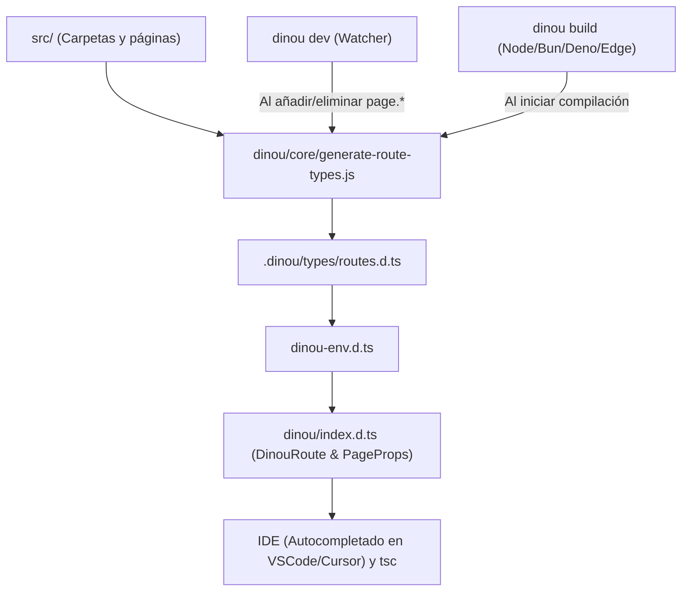

# 🛡️ Sistema de Type-Safe Routing en Dinou (Nivel 1 y Nivel 2)

Dinou incorpora un sistema de **rutas tipadas (Type-Safe Routing)** completo, elegante y con **cero coste en tiempo de ejecución (0 bytes en runtime)**. 

Este sistema transforma la experiencia de desarrollo (DX):
1. **Hacia afuera:** Autocompletado de URLs válidas y detección inmediata de enlaces rotos en `<Link>` y `useRouter()`.
2. **Hacia adentro:** Parámetros estrictamente tipados en los componentes `Page` y `Layout`, eliminando por completo la necesidad de escribir `params: any`.

---

## 🚀 1. Resumen Rápido para el Usuario

### Enlaces y Navegación (Nivel 1)
```tsx
import { Link, useRouter } from "dinou";

export default function Navigation() {
  const router = useRouter();

  return (
    <nav>
      {/* ✅ Autocompletado instantáneo en el editor */}
      <Link href="/demo/cookies">Cookies</Link>

      {/* ✅ Rutas dinámicas con template strings */}
      <Link href={`/blog/${post.slug}`}>Ver Post</Link>

      {/* ✅ Soporte para queries, hashes, rutas relativas y URLs externas */}
      <Link href="/demo?tab=settings#seccion-1">Ajustes</Link>
      <Link href="../contacto">Relativo</Link>
      <Link href="https://github.com">Externo</Link>

      {/* ❌ Error en rojo de TypeScript al escribir una ruta que no existe */}
      {/* <Link href="/ruta-inventada" /> */}

      <button onClick={() => router.push("/demo/redirects")}>
        Ir a Redirects
      </button>
    </nav>
  );
}
```

### Páginas y Layouts Tipados (Nivel 2)
```tsx
import type { PageProps, LayoutProps } from "dinou";

// src/blog/[slug]/page.tsx
export default function BlogPost({ params }: PageProps<"/blog/[slug]">) {
  // ✅ params.slug tiene tipo `string` automáticamente
  console.log(params.slug);

  // ❌ Error de TypeScript: Property 'id' does not exist on type '{ slug: string }'
  // console.log(params.id);

  return <h1>Post: {params.slug}</h1>;
}

// src/blog/[slug]/layout.tsx
export function BlogLayout({ children, params }: LayoutProps<"/blog/[slug]">) {
  return (
    <section>
      <header>Categoría de {params.slug}</header>
      <main>{children}</main>
    </section>
  );
}
```

---

## 🧩 2. Tabla de Correspondencia de Parámetros

Dinou traduce automáticamente las convenciones del sistema de archivos a tipos de TypeScript:

| Convención de Carpeta | Tipo de Parámetro Inferido | Ejemplo de Ruta | Tipo de `params` |
| :--- | :--- | :--- | :--- |
| **Estática** | Sin parámetros | `src/about/page.tsx` | `Record<string, never>` |
| **Dinámica simple** `[id]` | `string` | `src/blog/[id]/page.tsx` | `{ id: string }` |
| **Catch-all** `[...slug]` | `string[]` | `src/docs/[...slug]/page.tsx` | `{ slug: string[] }` |
| **Opcional simple** `[[lang]]` | `string \| undefined` | `src/[[lang]]/page.tsx` | `{ lang?: string }` |
| **Catch-all opcional** `[[...opt]]` | `string[] \| undefined` | `src/shop/[[...opt]]/page.tsx` | `{ opt?: string[] }` |
| **Múltiples parámetros** | Mixtos según orden | `src/users/[uId]/posts/[pId]` | `{ uId: string; pId: string }` |
| **Opcionales anidados** | Dependientes posicionales | `inventory/[[wh]]/[[aisle]]` | `{ wh?: string; aisle?: string }` |

> **Nota sobre rutas opcionales (`[[foo]]` y `[[...opt]]`):**
> Dinou genera tanto la versión con parámetros como la versión base sin parámetros. 
> Por ejemplo, para `src/t-params/[[slug]]/page.tsx`, tanto `<Link href="/t-params" />` como `<Link href="/t-params/mi-item" />` son enlaces válidos y autocompletados.

---

## 🏗️ 3. Arquitectura Técnica: Cómo Funciona por Debajo

El sistema consta de 4 piezas modulares que interactúan de forma limpia:



### 1. El Generador Ligero (`dinou/core/generate-route-types.js`)
* Realiza un escaneo directo de nombres de archivo y carpetas en `src/` mediante `readdirSync`.
* **Cero ejecución de código:** No importa archivos del usuario, no ejecuta `getStaticPaths()`, ni monta servidores mock. Tarda apenas **2 milisegundos**.
* Ignora carpetas privadas `_*` y slots paralelos `@*`.
* Desempaqueta limpiamente los Route Groups `(group)` (no forman parte de la URL).
* Desgrana recursivamente los segmentos opcionales finales (`[[foo]]`) para registrar todas las combinaciones estáticas y dinámicas posibles.

### 2. Archivo de Definiciones (`.dinou/types/routes.d.ts`)
* Es autogenerado por Dinou en la raíz del proyecto.
* Declara la unión `DinouStaticRoutes` y las plantillas `DinouDynamicRoutes`.
* Declara el mapa estricto `DinouRouteParamsMap` con todos los parámetros conocidos de cada ruta.
* Realiza un **Module Augmentation** limpio sobre el paquete `"dinou"`:
  ```typescript
  import "dinou";

  declare module "dinou" {
    namespace DinouRouter {
      interface Register {
        route: DinouGeneratedRoute;
        params: DinouRouteParamsMap;
      }
    }
  }
  ```

### 3. Tipos Maestros del Framework (`dinou/index.d.ts`)
* Define la interfaz extensible `DinouRouter.Register`.
* Extrae dinámicamente `DinouRoute` a partir de dicha interfaz (degradándose a `string` si aún no se ha generado ningún archivo).
* Tipa `LinkProps.href`, `LinkProps.to` y los métodos `router.push()` y `router.replace()`.
* Proporciona la utilidad de tipos condicionales `ExtractRouteParams<T>`, que es capaz de inferir los parámetros de cualquier plantilla literal recursivamente sin necesidad de código en runtime.

### 4. Integración Automática (`dinou-env.d.ts`)
* Al ejecutarse, el generador asegura que [dinou-env.d.ts](file:///c:/Users/roggc/dev/my-dinou-apps/dinou-e2e/dinou-env.d.ts) contenga:
  ```typescript
  /// <reference path="./.dinou/types/routes.d.ts" />
  ```
  De este modo, tanto el editor como el compilador `tsc` reconocen los tipos en todo el proyecto de inmediato.

---

## ⚡ 4. Ciclo de Vida: Dev Server y Compilación de Producción

### En Desarrollo (`npm run dev`)
* En [dinou/node/dev.mjs](file:///c:/Users/roggc/dev/my-dinou-apps/dinou-e2e/dinou/node/dev.mjs), se invoca `generateRouteTypes()` al inicio.
* El watcher `srcWatcher` (basado en Chokidar) escucha eventos de creación (`add`) y borrado (`unlink`) de archivos `page.(tsx|jsx|ts|js)`.
* Al añadir o eliminar una página, regenera `.dinou/types/routes.d.ts` al vuelo en ~2ms, por lo que **el editor actualiza el autocompletado en tiempo real sin reiniciar el servidor**.

### En Compilaciones de Producción (`npm run build`)
* Todos los constructores de Dinou ([dinou/node/bundle-dual-engine.mjs](file:///c:/Users/roggc/dev/my-dinou-apps/dinou-e2e/dinou/node/bundle-dual-engine.mjs), [dinou/bun/build.mjs](file:///c:/Users/roggc/dev/my-dinou-apps/dinou-e2e/dinou/bun/build.mjs), [dinou/deno/build.mjs](file:///c:/Users/roggc/dev/my-dinou-apps/dinou-e2e/dinou/deno/build.mjs) y [dinou/cloudflare/build.mjs](file:///c:/Users/roggc/dev/my-dinou-apps/dinou-e2e/dinou/cloudflare/build.mjs)) ejecutan `generateRouteTypes()` al arrancar.
* Esto garantiza que en entornos limpios de **CI/CD (GitHub Actions, Docker, Vercel, etc.)**, donde la carpeta `.dinou/` no está commiteada en git, los tipos se creen antes de que cualquier chequeo de tipos (`tsc`) o empaquetador los necesite.

---

## 💡 5. Ejemplos Avanzados de Uso

### Acceder a Query Parameters (`useSearchParams`)
En Dinou, las páginas no reciben `searchParams` por props, sino a través del hook oficial `useSearchParams()` (compatible tanto en **Server Components** como en **Client Components**):

```tsx
import { useSearchParams, type PageProps } from "dinou";

export default function SearchPage({ params }: PageProps<"/search">) {
  const searchParams = useSearchParams();
  const query = searchParams.get("q"); // string | null

  return <div>Buscando: {query}</div>;
}
```

Y en el archivo de servidor `page_functions.ts`, puedes acceder a los query parameters de la petición mediante `getContext()`:

```typescript
import { getContext } from "dinou";

export async function getProps(params: any) {
  const ctx = getContext();
  const query = ctx.req?.query; // { q: "..." }
  return {
    initialQuery: query?.q ?? "",
  };
}
```

### Flujo de Desarrollo: Elegir la Ruta en las Páginas
Al tipar un componente de página:
1. Importa `PageProps` desde `"dinou"`.
2. Escribe `PageProps<"">` en la declaración de tu componente.
3. Abre el autocompletado (`Ctrl + Espacio` o `Cmd + Espacio`). Tu IDE mostrará todas las rutas registradas en el proyecto (ej: `"/blog/[slug]"`, `"/search"`).
4. Elige tu ruta. A partir de ese momento, `params` queda fuertemente tipado con sus parámetros correctos:

```tsx
import type { PageProps } from "dinou";

// Pulsa Ctrl + Espacio dentro de "" para elegir tu ruta
export default function BlogPost({ params }: PageProps<"/blog/[slug]">) {
  return <h1>{params.slug}</h1>;
}
```

### Tipar Páginas de Error (`error.tsx`) sin `any`
En Dinou, los componentes de error (`error.tsx`, incluidos los slots paralelos `@slot/error.tsx`) reciben exactamente 2 props:
- `error`: El error capturado, que cumple estructuralmente la interfaz nativa `Error` de TypeScript (`{ message: string; name: string; stack?: string }`).
- `params`: Los parámetros dinámicos de la ruta.

Puedes tipar tus páginas de error extendiendo `PageProps`:

```tsx
"use client";

import { useRouter, type PageProps } from "dinou";

interface ErrorPageProps extends PageProps<"/blog/[slug]"> {
  error: Error;
}

export default function BlogPostError({ params, error }: ErrorPageProps) {
  const router = useRouter();

  return (
    <div className="error-container">
      <h2>Error al cargar el post: {params.slug}</h2>
      <p>{error.message}</p>
      {/* Recarga suave vía router de cliente */}
      <button onClick={() => router.refresh()}>Reintentar</button>
    </div>
  );
}
```

> **Diferencias Clave con Otros Frameworks:**
> * En Next.js, `error.tsx` está forzado a ser Client Component y recibe `{ error, reset }`.
> * En Dinou, `error.tsx` puede ser un **Server Component o un Client Component**. Dinou pasa `{ error, params }`. Para reintentar, se usa `useRouter().refresh()` o la navegación estándar del navegador.

### Navegación Dinámica con Parámetros Tipados
```tsx
import { Link, useRouter } from "dinou";

interface Item {
  id: string;
  name: string;
}

export function ItemCard({ item }: { item: Item }) {
  const router = useRouter();

  return (
    <div>
      {/* Interpolación de strings validada contra la plantilla `/items/${string | number}` */}
      <Link href={`/items/${item.id}`}>{item.name}</Link>

      <button onClick={() => router.push(`/items/${item.id}`)}>
        Detalles
      </button>
    </div>
  );
}
```

---

## 🛡️ 6. Compatibilidad y Cero Riesgo
* **Retrocompatibilidad:** Si en una página antigua o migrada no quieres especificar el tipo de ruta, puedes seguir usando `export default function Page({ params }: any)` o `PageProps` genérico. Nada se rompe.
* **Cero bytes en producción:** Todo ocurre en archivos `.d.ts`. Ningún archivo JavaScript distribuido en el bundle final contiene código adicional.
