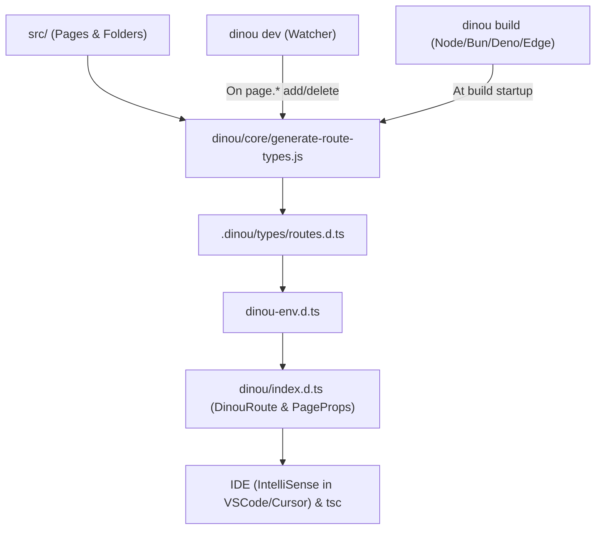

# 🛡️ Type-Safe Routing System in Dinou (Level 1 & Level 2)

Dinou features a complete, elegant **Type-Safe Routing** system with **zero runtime cost (0 extra bytes in the client or server bundle)**.

This system elevates the Developer Experience (DX) across two fundamental areas:
1. **Outward Navigation:** Instant URL autocompletion and compile-time dead-link detection in `<Link>` and `useRouter()`.
2. **Inward Consumption:** Strictly typed parameters in `Page` and `Layout` components, eliminating the need for `params: any`.

---

## 🚀 1. Quick Start for Developers

### Links & Navigation (Level 1)
```tsx
import { Link, useRouter } from "dinou";

export default function Navigation() {
  const router = useRouter();

  return (
    <nav>
      {/* ✅ Instant autocompletion in your IDE */}
      <Link href="/demo/cookies">Cookies</Link>

      {/* ✅ Dynamic routes with typed template strings */}
      <Link href={`/blog/${post.slug}`}>View Post</Link>

      {/* ✅ Seamless support for queries, hashes, relative paths, and external URLs */}
      <Link href="/demo?tab=settings#section-1">Settings</Link>
      <Link href="../contact">Relative</Link>
      <Link href="https://github.com">External</Link>

      {/* ❌ TypeScript compile-time error when pointing to a non-existent route */}
      {/* <Link href="/unknown-route" /> */}

      <button onClick={() => router.push("/demo/redirects")}>
        Go to Redirects
      </button>
    </nav>
  );
}
```

### Typed Pages and Layouts (Level 2)
```tsx
import type { PageProps, LayoutProps } from "dinou";

// src/blog/[slug]/page.tsx
export default function BlogPost({ params }: PageProps<"/blog/[slug]">) {
  // ✅ params.slug is strongly typed as `string`
  console.log(params.slug);

  // ❌ TypeScript error: Property 'id' does not exist on type '{ slug: string }'
  // console.log(params.id);

  return <h1>Post: {params.slug}</h1>;
}

// src/blog/[slug]/layout.tsx
export function BlogLayout({ children, params }: LayoutProps<"/blog/[slug]">) {
  return (
    <section>
      <header>Category: {params.slug}</header>
      <main>{children}</main>
    </section>
  );
}
```

---

## 🧩 2. Parameter Mapping Reference Table

Dinou automatically converts filesystem conventions into strict TypeScript types:

| Filesystem Convention | Inferred Parameter Type | Route Example | Type of `params` |
| :--- | :--- | :--- | :--- |
| **Static Route** | No parameters | `src/about/page.tsx` | `Record<string, never>` |
| **Single Dynamic** `[id]` | `string` | `src/blog/[id]/page.tsx` | `{ id: string }` |
| **Catch-All** `[...slug]` | `string[]` | `src/docs/[...slug]/page.tsx` | `{ slug: string[] }` |
| **Optional Dynamic** `[[lang]]` | `string \| undefined` | `src/[[lang]]/page.tsx` | `{ lang?: string }` |
| **Optional Catch-All** `[[...opt]]` | `string[] \| undefined` | `src/shop/[[...opt]]/page.tsx` | `{ opt?: string[] }` |
| **Multiple Parameters** | Mixed by segment order | `src/users/[uId]/posts/[pId]` | `{ uId: string; pId: string }` |
| **Nested Optional** | Positional dependent | `inventory/[[wh]]/[[aisle]]` | `{ wh?: string; aisle?: string }` |

> **Positional Optional Segments (`[[foo]]` and `[[...opt]]`):**
> Dinou registers both the parameterized dynamic route and the base route where the segment is omitted.
> For example, with `src/t-params/[[slug]]/page.tsx`, both `<Link href="/t-params" />` and `<Link href="/t-params/item-1" />` are valid, autocompleted routes.

---

## 🏗️ 3. Technical Architecture: Under the Hood

The architecture consists of four modular components that coordinate seamlessly:



### 1. The Lightweight Route Scanner (`dinou/core/generate-route-types.js`)
* Traverses `src/` using synchronous `readdirSync` to detect files named `page.(tsx|jsx|ts|js)`.
* **Zero code execution:** It does not import user files, execute `getStaticPaths()`, or spin up test servers. Total execution time is **under 2 milliseconds**.
* Transparently ignores private directories (`_*`) and parallel route slots (`@*`).
* Unpacks Route Groups `(group)` so they are excluded from the public URL path.
* Progressively peels off trailing optional segments (`[[foo]]`) to compute all static and dynamic path combinations.

### 2. Auto-Generated Definitions (`.dinou/types/routes.d.ts`)
* Automatically created in the project root inside `.dinou/types/`.
* Emits union types `DinouStaticRoutes` and template literal types `DinouDynamicRoutes`.
* Emits the exact parameter contract `DinouRouteParamsMap`.
* Uses **Module Augmentation** on the `"dinou"` package via an extensible interface:
  ```typescript
  import "dinou";

  declare module "dinou" {
    namespace DinouRouter {
      interface Register {
        route: DinouGeneratedRoute;
        params: DinouRouteParamsMap;
      }
    }
  }
  ```

### 3. Framework Master Types (`dinou/index.d.ts`)
* Declares the extensible `DinouRouter.Register` interface.
* Derives `DinouRoute` dynamically from `DinouRouter.Register` (gracefully falling back to `string` if no types have been generated yet).
* Types `LinkProps.href`, `LinkProps.to`, `router.push()`, and `router.replace()`.
* Provides the recursive conditional type `ExtractRouteParams<T>`, which infers route parameters from template strings without needing runtime code.

### 4. Automatic Project Integration (`dinou-env.d.ts`)
* The generator ensures that [dinou-env.d.ts](file:///c:/Users/roggc/dev/my-dinou-apps/dinou-e2e/dinou-env.d.ts) includes:
  ```typescript
  /// <reference path="./.dinou/types/routes.d.ts" />
  ```
  This guarantees that editors and `tsc` recognize the augmented types project-wide without requiring manual configuration.

---

## ⚡ 4. Lifecycle: Dev Server & Production Builds

### In Development (`npm run dev`)
* In [dinou/node/dev.mjs](file:///c:/Users/roggc/dev/my-dinou-apps/dinou-e2e/dinou/node/dev.mjs), `generateRouteTypes()` executes immediately at startup.
* The Chokidar file watcher (`srcWatcher`) listens for `add` and `unlink` events on `page.(tsx|jsx|ts|js)` files.
* When a page is added or deleted, `.dinou/types/routes.d.ts` regenerates on the fly (~2ms), **updating IDE autocompletion in real time without restarting the dev server**.

### In Production Builds (`npm run build`)
* All Dinou target bundlers ([dinou/node/bundle-dual-engine.mjs](file:///c:/Users/roggc/dev/my-dinou-apps/dinou-e2e/dinou/node/bundle-dual-engine.mjs), [dinou/bun/build.mjs](file:///c:/Users/roggc/dev/my-dinou-apps/dinou-e2e/dinou/bun/build.mjs), [dinou/deno/build.mjs](file:///c:/Users/roggc/dev/my-dinou-apps/dinou-e2e/dinou/deno/build.mjs), and [dinou/cloudflare/build.mjs](file:///c:/Users/roggc/dev/my-dinou-apps/dinou-e2e/dinou/cloudflare/build.mjs)) invoke `generateRouteTypes()` at build initialization.
* This ensures that clean **CI/CD pipelines (GitHub Actions, Docker, Vercel, etc.)**, where the `.dinou/` directory is gitignored, generate the definitions before any type-checking (`tsc`) or bundling step begins.

---

## 💡 5. Advanced Usage Examples

### Working with Query Parameters (`useSearchParams`)
In Dinou, pages do not receive `searchParams` via props. Instead, you access query parameters using the official `useSearchParams()` hook (fully compatible in both **Server Components** and **Client Components**):

```tsx
import { useSearchParams, type PageProps } from "dinou";

export default function SearchPage({ params }: PageProps<"/search">) {
  const searchParams = useSearchParams();
  const query = searchParams.get("q"); // string | null

  return <div>Searching for: {query}</div>;
}
```

In server-side `page_functions.ts` files, you can access the request's query parameters via `getContext()`:

```typescript
import { getContext } from "dinou";

export async function getProps(params: any) {
  const ctx = getContext();
  const query = ctx.req?.query; // { q: "..." }
  return {
    initialQuery: query?.q ?? "",
  };
}
```

### Dynamic Navigation with Typed Interpolation
```tsx
import { Link, useRouter } from "dinou";

interface Product {
  id: string;
  name: string;
}

export function ProductCard({ product }: { product: Product }) {
  const router = useRouter();

  return (
    <div>
      {/* String interpolation verified against `/products/${string | number}` */}
      <Link href={`/products/${product.id}`}>{product.name}</Link>

      <button onClick={() => router.push(`/products/${product.id}`)}>
        View Details
      </button>
    </div>
  );
}
```

---

## 🛡️ 6. Backward Compatibility & Zero-Runtime Guarantee
* **100% Backward Compatible:** Existing pages without explicit route types can continue using `export default function Page({ params }: any)` or generic `PageProps`. Nothing breaks.
* **0 Runtime Overhead:** Everything exists strictly within `.d.ts` files. Production client and server JavaScript bundles do not contain any additional bytes or overhead.
